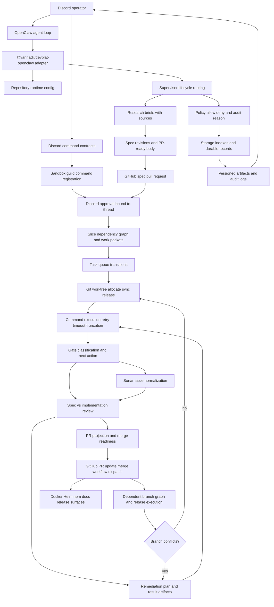

[](https://github.com/VannaDii/devplat/actions/workflows/ci.yml) [](https://sonarcloud.io/summary/new_code?id=vannadii_devplat) [](https://sonarcloud.io/summary/new_code?id=vannadii_devplat) [](https://sonarcloud.io/summary/new_code?id=vannadii_devplat) [](https://artifacthub.io/packages/search?repo=devplat)

# Development Platform

DevPlat is a Discord-first autonomous software-delivery platform built as a strict native-ESM TypeScript monorepo. Platform packages own domain logic, orchestration, contracts, and persistence; `@vannadii/devplat-openclaw` exposes that platform into OpenClaw; Discord operates as the primary human control plane; GitHub remains the system of record for specs, pull requests, reviews, and merge history.

## Platform Model

- research -> spec PR -> human approval -> slicing -> implementation PRs
- automated gates, review, and remediation loops
- operator control through OpenClaw + Discord with auditable artifacts
- publication through GitHub Packages npm packages, GHCR Docker, GHCR OCI Helm, and GitHub Pages



## Runtime Baseline

- Node.js `v24.14.1` from `.nvmrc`
- `packageManager` `npm@11.12.1`
- TypeScript `6.0.3` as the authoring baseline

Always activate the pinned runtime before development:

```bash
nvm use
npm ci
```

Compatibility validation runs on Linux only against the latest stable TypeScript `5.x` and `6.x` releases. Primary authoring targets TypeScript `6.0.3`.

## Baseline Commands

```bash
npm run check:repo
npm run check:pre-push
npm run test:coverage
npm run test:openclaw:deep
npm run docs:build
npm run act:pr
npm run sonar:install-cli
npm run sonar:analyze:changed
```

`npm run check:unit-tests`, included in `check:repo`, verifies that every
non-trivial `logic.ts` and `service.ts` has a sibling test and that every
`.test.ts`, `.test.mts`, and `.test.mjs` file uses the structured
`const cases = [...]` table with `inputs`, `mock`, and `assert` fields plus a
single `it.each(cases)('$name', ...)` runner instead of ad hoc loops.
`npm run check:regex-governance`, also included in `check:repo`, verifies that
package regular-expression patterns are named constants in `constants.ts`, use
the `PATTERN` suffix, and are referenced by package tests.

`npm run act:pr` runs the pull-request CI and TypeScript matrix workflows
locally through Docker using `act`, `.actrc`, and
`.github/act/pull_request.json`. The wrapper at `scripts/run-act.sh` cleans up
`act-*` Docker containers and `.artifacts/act` before and after each workflow,
then runs the hermetic OpenClaw deep test outside `act` so nested Docker volume
paths resolve on the host. The fixture deliberately uses a secretless bot-style
PR event so publish and Sonar upload paths stay skipped locally. The CI workflow
also skips remote artifact upload/download actions under `ACT=true` and skips
the nested-Docker deep-test job for the `devplat-local-act` actor while still
executing repo, coverage, build, docs, generated artifact, and compatibility
jobs. Remote CI names shared generated, coverage, build, and docs artifacts by
workflow run id rather than run attempt, with overwrite enabled, so rerunning a
failed job can still download the artifacts produced earlier in the same run.

`npm run sonar:install-cli` installs the SonarQube CLI through the repo helper,
which selects the documented SonarSource installer for macOS, Linux, or Windows.
After authenticating with `sonar auth login`, run `npm run sonar:analyze:changed`
to scan changed files with `sonar analyze secrets` and per-file
`sonar verify --file` commands. The wrapper runs configured analyses in
parallel, prints a plain-text summary by default, and supports `--json` for
agent-readable reports. SQAA/A3S analysis is intentionally disabled unless
`SONAR_A3S_ENABLED=true`, `DEVPLAT_SONAR_A3S_ENABLED=true`, or `--sqaa enabled`
is supplied; when enabled it also runs per-file `sonar analyze sqaa --file`
commands. If SQAA returns
`A3S analysis is not activated for this organization`, the helper reports that
capability as skipped instead of allowing the whole analysis run to fail. If the
local CLI is not authenticated, the helper reports changed-file verification as
skipped with an explicit `sonar auth login` hint while CI remains the
authoritative Sonar gate. The wrapper derives the current branch and defaults
the project to `vannadii_devplat`; override with `--project`, `--branch`,
`--base`, or `--head` only for exceptional local comparisons.

Runtime configuration is repository-scoped for the single-repo production path.
Set `GITHUB_OWNER`, `GITHUB_REPO`, `GITHUB_DEFAULT_BRANCH`, GitHub API/token
overrides, runtime storage/worktree overrides, Docker/Helm deployment
overrides, and the Discord/OpenClaw/Sonar variables documented in the
configuration guide before running live operator flows. Config loading now
normalizes those defaults, derives the Discord category name from `GITHUB_REPO`
for multi-repository guild separation unless test traffic explicitly sets
`DISCORD_CATEGORY_NAME=test`, configures outbound Discord Gateway interaction
handling with `DISCORD_GATEWAY_URL` and `DISCORD_GATEWAY_INTENTS`, and returns
structured validation issues for bad URLs, empty required paths, invalid
deployment targets, and invalid gateway ports. The storage package remains the
only package that directly reads or writes the committed runtime state
directory.
The Helm chart mirrors that runtime path with typed `discordGateway.enabled`,
`discordGateway.url`, and `discordGateway.intents` values that render the
Gateway env vars into the runtime container.

The live lab posts compact status payloads without stale interactive components,
registers Discord operator commands in the sandbox guild, and records
callback-shaped slash-command and button interaction evidence in its report.
The automated probe keeps its simulated deferred acknowledgements as local
receipts because those payloads do not have real Discord interaction tokens;
the bound control-plane payloads still post through the real Discord channel
transport and record response endpoints, Discord message ids, posted content,
and component custom ids from the posted messages. The initial
project-management bootstrap message is a required acceptance signal; if
Discord cannot post it, the live lab fails before mutating sandbox repository
state. The report preserves that bootstrap receipt with channel id, message id,
posted content, and an empty component id list so operators can audit the
visible start signal without leaving unbound status buttons that outlive the
ephemeral runner.
Human-triggered Discord client clicks are deferred as a manual sandbox-guild
acceptance check because Discord does not expose a supported bot API for
clicking buttons as a user. The `operator_hold_ms` live-lab input defaults to
`150000`, keeping the private Gateway runtime open for a bounded 2.5 minute
manual-click window after the control message is posted. The live-lab control
message is posted in a short-lived implementation thread created under the
`test` category's standard implementation channel, so real button clicks
resolve to the same thread id encoded in the component payload and persisted
Gateway session.
Live-lab status posts render compact workflow links with URL previews
suppressed, and reports include selected channel `parentId` values so category
placement can be audited.
Live-lab runtime containers receive the same repo-scoped Discord/OpenClaw/Sonar
environment through Docker env-name pass-through while report artifacts keep
secret values redacted. The live container explicitly starts the private
Discord Gateway worker and points `DEVPLAT_STORAGE_ROOT` at the mounted
`.devplat` state directory so real sandbox-guild slash commands and button
clicks are acknowledged through the same thread binding store used by OpenClaw
tool execution. OpenClaw storage, telemetry, memory, Discord lifecycle,
GitHub submission, pull-request submission, and supervisor-step tools also
honor the trimmed configured storage root, and pull-request submission uses the
trimmed configured GitHub owner/repository identity. Worktree allocation and
dependent rebase tools honor the trimmed configured worktree root, so
tool-driven artifacts, telemetry, worktrees, and Discord interaction state stay
in the same repository-scoped store. Gate runs and Sonar quality-gate
evaluations record passed/failed classification, actor, coverage, blocking
issue, and next-action telemetry through that same store.
Valid operator
interactions are deferred before state, telemetry, and audit persistence
begins, then the bound thread receives the structured status payload after the
control result is durable. This avoids posting the same operator payload twice
in the thread while still satisfying Discord's prompt response window. If Discord
rejects the initial deferred acknowledgement, the acknowledgement transport throws, or a
route-refusal acknowledgement is rejected, DevPlat fails the action closed,
writes an audit event, and reports `responsePostError` without lifecycle state
changes. If the post-acknowledgement thread update fails, the control result
keeps the interaction receipt and durable action record while reporting
`threadPostError`. Interaction-originated requests are normalized once, so
persisted traces contain one Discord route marker for the action.
The live-lab runner loads built workspace package entrypoints during normal
execution and fails fast with a `npm run build:workspace` instruction if those
compiled entrypoints are missing under plain Node. Source package entrypoints
are only allowed for preflight tests or explicit TypeScript-loader execution.
Before host-side live-lab cleanup hooks persist extra Discord session records,
the deep-test runner normalizes container-owned `.devplat` bind-mount content
to the host runner owner with owner-only write permissions. If that auxiliary
normalization fails, the report records a warning and cleanup still runs, so
platform contract failures remain separate from local Docker permission repair.

Public contract schemas are generated from exported `io-ts` codecs. For
codec-owned lifecycle records, derive TypeScript types from those codecs rather
than duplicating interface shapes, then run `npm run generate:schemas` and
`npm run generate:openclaw-manifest` with the code change.

## Instruction Surfaces

- [`PLATFORM.md`](./PLATFORM.md): foundation-scope objective, package responsibilities, delivery surfaces, and acceptance criteria
- [`CONTRIBUTING.md`](./CONTRIBUTING.md): human workflow, review, and release contract
- [`AGENTS.md`](./AGENTS.md): terse coding-agent operating rules
- [`.github/copilot-instructions.md`](./.github/copilot-instructions.md): AI pair-programming rules
- [`.github/instructions/`](./.github/instructions): platform, architecture, performance, compatibility, release, testing, schema, review, and operator policies
- [`site/guide-docs/guides/platform-lifecycle.md`](./site/guide-docs/guides/platform-lifecycle.md): end-to-end platform flow
- [`site/guide-docs/guides/user-guide.md`](./site/guide-docs/guides/user-guide.md): setup, first small project validation, Discord checks, and troubleshooting
- [`site/guide-docs/guides/quality-performance-policy.md`](./site/guide-docs/guides/quality-performance-policy.md): complete-change and performance expectations
- [`site/guide-docs/guides/live-test-lab.md`](./site/guide-docs/guides/live-test-lab.md): dispatchable live end-to-end test lane and setup references
- `packages/*/README.md`: package-local ownership, boundary, and validation notes

## Distribution Surfaces

- `docker/openclaw-runtime`: GHCR runtime image
- `deploy/helm/devplat`: GHCR OCI Helm chart
- `site/guide-docs`: GitHub Pages documentation site
