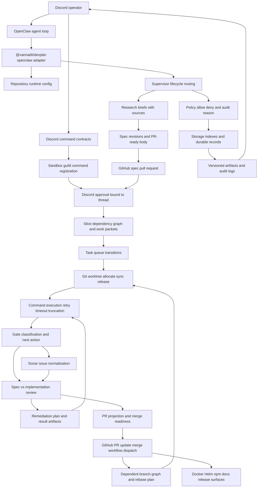

[](https://github.com/VannaDii/devplat/actions/workflows/ci.yml) [](https://sonarcloud.io/summary/new_code?id=vannadii_devplat) [](https://sonarcloud.io/summary/new_code?id=vannadii_devplat) [](https://sonarcloud.io/summary/new_code?id=vannadii_devplat) [](https://artifacthub.io/packages/search?repo=devplat)

# Development Platform

DevPlat is a Discord-first autonomous software-delivery platform built as a strict native-ESM TypeScript monorepo. Platform packages own domain logic, orchestration, contracts, and persistence; `@vannadii/devplat-openclaw` exposes that platform into OpenClaw; Discord operates as the primary human control plane; GitHub remains the system of record for specs, pull requests, reviews, and merge history.

## Platform Model

- research -> spec PR -> human approval -> slicing -> implementation PRs
- automated gates, review, and remediation loops
- operator control through OpenClaw + Discord with auditable artifacts
- publication through GitHub Packages npm packages, GHCR Docker, GHCR OCI Helm, and GitHub Pages



## Runtime Baseline

- Node.js `v24.14.1` from `.nvmrc`
- `packageManager` `npm@11.12.1`
- TypeScript `6.0.3` as the authoring baseline

Always activate the pinned runtime before development:

```bash
nvm use
npm ci
```

Compatibility validation runs on Linux only against the latest stable TypeScript `5.x` and `6.x` releases. Primary authoring targets TypeScript `6.0.3`.

## Baseline Commands

```bash
npm run check:repo
npm run check:pre-push
npm run test:coverage
npm run test:openclaw:deep
npm run docs:build
npm run act:pr
npm run sonar:install-cli
npm run sonar:analyze:changed
```

`npm run check:unit-tests`, included in `check:repo`, verifies that every
non-trivial `logic.ts` and `service.ts` has a sibling test and that every
`.test.ts`, `.test.mts`, and `.test.mjs` file uses the structured
`const cases = [...]` table with `inputs`, `mock`, and `assert` fields.

`npm run act:pr` runs the pull-request CI and TypeScript matrix workflows
locally through Docker using `act`, `.actrc`, and
`.github/act/pull_request.json`. The wrapper at `scripts/run-act.sh` cleans up
`act-*` Docker containers and `.artifacts/act` before and after each workflow,
then runs the hermetic OpenClaw deep test outside `act` so nested Docker volume
paths resolve on the host. The fixture deliberately uses a secretless bot-style
PR event so publish and Sonar upload paths stay skipped locally. The CI workflow
also skips remote artifact upload/download actions under `ACT=true` and skips
the nested-Docker deep-test job for the `devplat-local-act` actor while still
executing repo, coverage, build, docs, generated artifact, and compatibility
jobs.

`npm run sonar:install-cli` installs the SonarQube CLI through the repo helper,
which selects the documented SonarSource installer for macOS, Linux, or Windows.
After authenticating with `sonar auth login`, run `npm run sonar:analyze:changed`
to scan changed files with
`sonar analyze secrets` and per-file `sonar analyze sqaa --file` commands. The
wrapper derives the current branch and defaults the project to `vannadii_devplat`;
override with `--project`, `--branch`, `--base`, or `--head` only for exceptional
local comparisons.

Runtime configuration is repository-scoped for the single-repo production path.
Set `GITHUB_OWNER`, `GITHUB_REPO`, `GITHUB_DEFAULT_BRANCH`, GitHub API/token
overrides, runtime storage/worktree overrides, Docker/Helm deployment
overrides, and the Discord/OpenClaw/Sonar variables documented in the
configuration guide before running live operator flows. Config loading now
normalizes those defaults, derives the Discord category name from `GITHUB_REPO`
for multi-repository guild separation unless test traffic explicitly sets
`DISCORD_CATEGORY_NAME=test`, and returns structured validation issues for bad
URLs, empty required paths, invalid deployment targets, and invalid gateway
ports. The storage package remains the only package that directly reads or
writes the committed runtime state directory.

The live lab registers Discord operator commands in the sandbox guild and records
callback-shaped interaction evidence in its report, including response endpoints,
Discord message ids, posted content, and component custom ids. Human-triggered
Discord client clicks remain a manual sandbox-guild acceptance check because
Discord does not expose a supported bot API for clicking buttons as a user.
Live-lab status posts use compact operator payloads without raw GitHub URLs, and
reports include selected channel `parentId` values so category placement can be
audited.
Live-lab runtime containers receive the same repo-scoped Discord/OpenClaw/Sonar
environment through Docker env-name pass-through while report artifacts keep
secret values redacted.

Public contract schemas are generated from exported `io-ts` codecs. For
codec-owned lifecycle records, derive TypeScript types from those codecs rather
than duplicating interface shapes, then run `npm run generate:schemas` and
`npm run generate:openclaw-manifest` with the code change.

## Instruction Surfaces

- [`PLATFORM.md`](./PLATFORM.md): foundation-scope objective, package responsibilities, delivery surfaces, and acceptance criteria
- [`CONTRIBUTING.md`](./CONTRIBUTING.md): human workflow, review, and release contract
- [`AGENTS.md`](./AGENTS.md): terse coding-agent operating rules
- [`.github/copilot-instructions.md`](./.github/copilot-instructions.md): AI pair-programming rules
- [`.github/instructions/`](./.github/instructions): platform, architecture, performance, compatibility, release, testing, schema, review, and operator policies
- [`site/guide-docs/guides/platform-lifecycle.md`](./site/guide-docs/guides/platform-lifecycle.md): end-to-end platform flow
- [`site/guide-docs/guides/user-guide.md`](./site/guide-docs/guides/user-guide.md): setup, first small project validation, Discord checks, and troubleshooting
- [`site/guide-docs/guides/quality-performance-policy.md`](./site/guide-docs/guides/quality-performance-policy.md): complete-change and performance expectations
- [`site/guide-docs/guides/live-test-lab.md`](./site/guide-docs/guides/live-test-lab.md): dispatchable live end-to-end test lane and setup references
- `packages/*/README.md`: package-local ownership, boundary, and validation notes

## Distribution Surfaces

- `docker/openclaw-runtime`: GHCR runtime image
- `deploy/helm/devplat`: GHCR OCI Helm chart
- `site/guide-docs`: GitHub Pages documentation site
