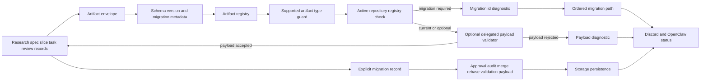

# @vannadii/devplat-artifacts

Versioned artifact contracts for DevPlat.

## Responsibility

This package owns auditable artifact envelopes, the default lifecycle artifact registry, migration records, and known artifact payloads for approvals, audit logs, merge decisions, rebase results, and validation. It is the contract layer for handoffs between planning, execution, review, remediation, Discord, OpenClaw, and GitHub-facing flows.

Artifact envelopes use the shared supported artifact vocabulary from `@vannadii/devplat-core`, and the generated artifact-envelope schema exposes that vocabulary as the allowed `artifactType` enum. Artifact validation then dispatches locally owned payload codecs for approval, audit, merge-decision, and rebase-result records. Registry-supported lifecycle artifacts owned by downstream packages validate at the generic envelope boundary by default, and callers such as the OpenClaw adapter can supply delegated package payload validators so research, spec, slice, task, gate, review, remediation, PR, telemetry, worktree, and Discord thread-session envelopes fail closed when their embedded payload no longer satisfies the owning package codec. Unsupported artifact types fail before generic normalization so unknown payload families cannot be persisted as valid handoffs. When an active repository registry is supplied, validation also rejects unregistered artifact types, newer-than-registered versions, and stale versions whose registry entry requires migration. Required migration failures include the matching registry migration id or ordered migration path when records can bridge the artifact version to the active version, so operators can route the exact artifact upgrade.

## Real-World Flow



## Boundaries

- Keep artifact shape, version, migration metadata, and validation here.
- Keep the registry as the machine-readable source for artifact type ownership, current versions, storage scopes, and migration policy.
- Do not put workflow orchestration or external API calls in this package.
- Keep public contracts aligned with codecs, generated schemas, docs, and tests.
- Keep public TypeScript contracts derived from the exported codecs.

## Development

```bash
npm run test --workspace @vannadii/devplat-artifacts
```
