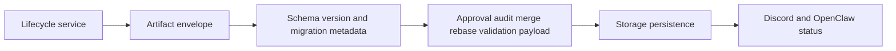

# @vannadii/devplat-artifacts

Versioned artifact contracts for DevPlat.

## Responsibility

This package owns auditable artifact envelopes and known artifact payloads for approvals, audit logs, merge decisions, rebase results, and validation. It is the contract layer for handoffs between planning, execution, review, remediation, Discord, OpenClaw, and GitHub-facing flows.

## Real-World Flow



## Boundaries

- Keep artifact shape, version, migration metadata, and validation here.
- Do not put workflow orchestration or external API calls in this package.
- Keep public contracts aligned with codecs, generated schemas, docs, and tests.

## Development

```bash
npm run test --workspace @vannadii/devplat-artifacts
```
