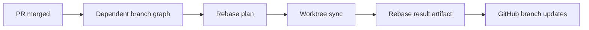

# @vannadii/devplat-branching

Downstream branch coordination contracts.

## Responsibility

This package owns branch dependency planning and rebase execution result modeling after pull request merges. It coordinates with worktree synchronization rather than implementing GitHub review or merge behavior directly.

## Real-World Flow



## Boundaries

- Keep dependent-branch graph and conflict classification contracts here.
- Keep rebase plan and execution-result types derived from the exported codecs.
- Delegate actual worktree sync behavior to `@vannadii/devplat-worktrees`.
- Do not call Discord or OpenClaw from this package.

## Development

```bash
npm run test --workspace @vannadii/devplat-branching
```
