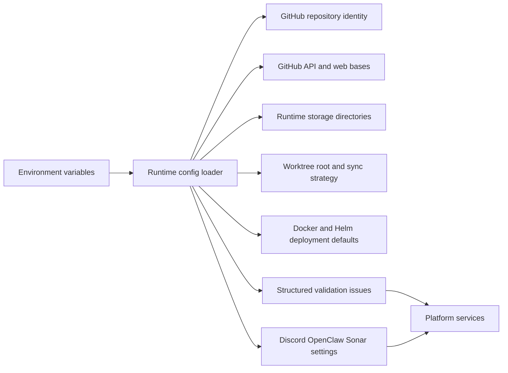

# @vannadii/devplat-config

Configuration loading and normalization for DevPlat.

## Responsibility

This package owns repository-scoped runtime configuration for the production
path: GitHub identity, default branch, storage layout, worktree layout,
deployment defaults, Discord runtime settings, OpenClaw gateway settings, and
SonarCloud project configuration. Discord category names default to the
configured repository name so multiple configured repositories can share a guild
without mixing operator surfaces; tests and live-lab runs override the category
to `test`.
Repository default branches and worktree base branches validate with the shared
Git branch codec, repository keys validate with the shared repository-key codec,
and persisted config records validate `updatedAt` with the shared ISO timestamp
codec.

## Real-World Flow



## Boundaries

- Keep environment parsing, defaults, and structured config validation here.
- Validate repository identity, branch refs, and config timestamps with shared
  core codecs.
- Do not perform network checks or load external service state.
- Keep schema, codec, docs, and tests aligned whenever config fields change.
- Keep public TypeScript contracts derived from the exported codecs.

## Runtime Defaults

- Storage defaults to `devplat-state` with `artifacts`, `indexes`, and `audit` directories.
- Worktrees default to `devplat-state/worktrees` and use `rebase-or-fast-forward` sync.
- Deployment defaults target local Docker with the published OpenClaw runtime image and the `deploy/helm/devplat` chart.
- GitHub defaults to `https://api.github.com`, `https://github.com`, and `GITHUB_TOKEN`.
- Discord category names default to `GITHUB_REPO`; use `DISCORD_CATEGORY_NAME=test` only for OpenClaw test and live-lab traffic.
- Discord operator interactions use the outbound Gateway transport by default, with `DISCORD_GATEWAY_URL` defaulting to `wss://gateway.discord.gg/?v=10&encoding=json` and `DISCORD_GATEWAY_INTENTS` defaulting to `0`.

## Development

```bash
npm run test --workspace @vannadii/devplat-config
```
