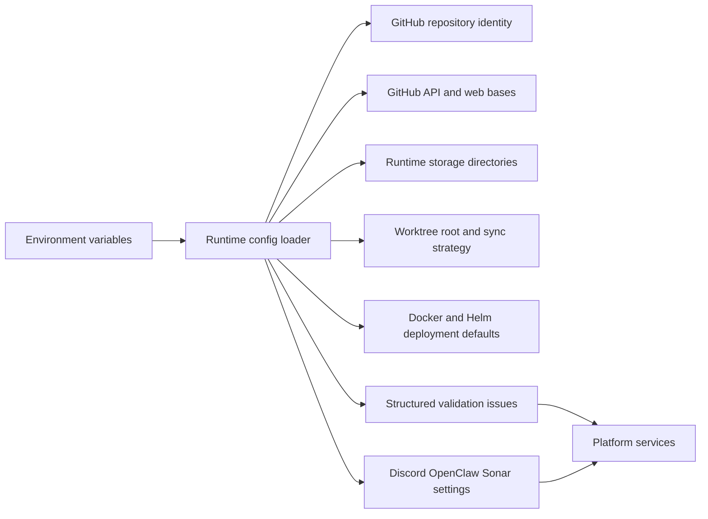

# @vannadii/devplat-config

Configuration loading and normalization for DevPlat.

## Responsibility

This package owns repository-scoped runtime configuration for the single-repo production path: GitHub identity, default branch, storage layout, worktree layout, deployment defaults, Discord runtime settings, OpenClaw gateway settings, and SonarCloud project configuration.

## Real-World Flow



## Boundaries

- Keep environment parsing, defaults, and structured config validation here.
- Do not perform network checks or load external service state.
- Keep schema, codec, docs, and tests aligned whenever config fields change.
- Keep public TypeScript contracts derived from the exported codecs.

## Runtime Defaults

- Storage defaults to `devplat-state` with `artifacts`, `indexes`, and `audit` directories.
- Worktrees default to `devplat-state/worktrees` and use `rebase-or-fast-forward` sync.
- Deployment defaults target local Docker with the published OpenClaw runtime image and the `deploy/helm/devplat` chart.
- GitHub defaults to `https://api.github.com`, `https://github.com`, and `GITHUB_TOKEN`.

## Development

```bash
npm run test --workspace @vannadii/devplat-config
```
