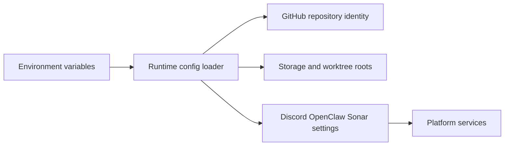

# @vannadii/devplat-config

Configuration loading and normalization for DevPlat.

## Responsibility

This package owns repository-scoped runtime configuration for the single-repo production path: GitHub identity, default branch, storage root, worktree root, Discord runtime settings, OpenClaw gateway settings, and SonarCloud project configuration.

## Real-World Flow



## Boundaries

- Keep environment parsing and defaults here.
- Do not perform network checks or load external service state.
- Keep schema, codec, docs, and tests aligned whenever config fields change.

## Development

```bash
npm run test --workspace @vannadii/devplat-config
```
