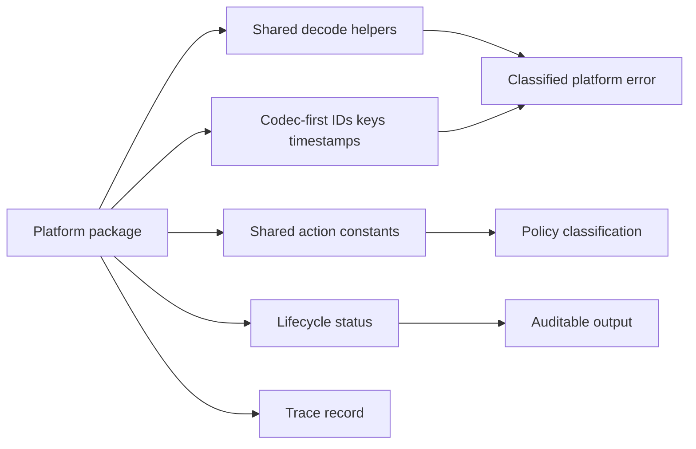

# @vannadii/devplat-core

Shared domain primitives for DevPlat.

## Responsibility

This package owns lifecycle statuses, trace records, shared lifecycle action
constants for operator, policy, GitHub, gate, worktree, and command execution
flows, codec-first typed value objects, classified platform errors,
codec-derived public types, and shared decode helpers used by all platform
packages.

## Real-World Flow



## Boundaries

- Keep primitives dependency-light and reusable.
- Do not add package-specific lifecycle rules here; keep only shared vocabulary and primitives.
- Keep errors, value objects, statuses, and trace-record changes codec-first and compatible with generated schemas.

## Development

```bash
npm run test --workspace @vannadii/devplat-core
```
