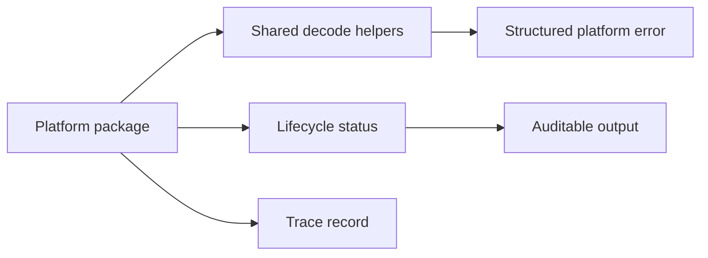

# @vannadii/devplat-core

Shared domain primitives for DevPlat.

## Responsibility

This package owns lifecycle statuses, trace records, typed ID aliases, structured platform errors, exactness helpers, and shared decode helpers used by all platform packages.

## Real-World Flow



## Boundaries

- Keep primitives dependency-light and reusable.
- Do not add package-specific lifecycle rules here.
- Keep error and status changes compatible with codecs and generated schemas.

## Development

```bash
npm run test --workspace @vannadii/devplat-core
```
