# @vannadii/devplat-discord

Discord control plane workflows.

## Responsibility

This package owns Discord thread sessions, channel bindings, interactive
approval requests, the private outbound Discord Gateway interaction runtime,
signature-verified interaction webhook helpers, bound work-item projections, and
operator control actions backed by the shared lifecycle action constants.
Runtime behavior must resolve bound thread context and
fail closed when a lifecycle-changing action is ambiguous. Slash command and
button interactions are received over Discord Gateway by default, routed into
control actions, must resolve exactly one bound thread or bound thread session,
project that session into a typed spec/implementation/pull-request work item,
render compact operator UI payloads with contextual buttons, defer the
interaction acknowledgement, and post the final thread status message through
the structured Discord REST transport before sending a minimal ephemeral
completion follow-up for the deferred interaction. Thread sessions persist the dedicated
shared `discord-thread-session` artifact type, and interactive approvals persist
approval artifacts, so Discord operator decisions remain compatible with the
shared artifact envelope schema without masquerading as spec, slice, or pull
request payloads.
Interaction acknowledgements are deferred before persistence
and audit writes so live button clicks satisfy Discord's prompt response window
without duplicating the final operator message in the same thread; the
bound-thread message, deferred-completion receipt, and audit trail are then
persisted through the same control result. If Discord rejects the initial deferred acknowledgement, the
acknowledgement transport throws, or a route-refusal acknowledgement is rejected,
the action fails closed, skips lifecycle state writes, writes an audit event,
and exposes `responsePostError`. If the bound-thread status post fails after
acknowledgement, the result preserves the interaction acknowledgement receipt
and durable action record, exposes `threadPostError`, and still sends a minimal
ephemeral completion follow-up so Discord closes the deferred interaction
deterministically. Interaction completion failures expose `completionPostError`
without reposting the full button-bearing operator payload.
requests are normalized once, so persisted traces contain one Discord route
marker for the action. The webhook helper returns the same structured payload
shape for explicit deployments that choose inbound callbacks, but the production
runtime path does not require public ingress. Route failures and policy denials use standard
blocked/refused messages and still write audit records. The exported
command contract registry is the source for guild slash-command registration;
the operator-facing command flow is documented in the guide docs'
`operator-guide.md`, and the exact slash-command table is documented in
`discord-workflows.md`.
The live lab registers those commands and includes a Discord callback-shaped
interaction probe so this response path is validated from raw slash-command
payload normalization through operator-visible Discord messages, not only local
unit tests. The live-lab probe fails if the acknowledgement or thread message
loses the structured button rows, posts those component-bearing payloads, and
records the message ids, content, and component custom ids in the live-lab report
for audit review while the private Gateway runtime is still alive. The live-lab
`operator_hold_ms` input keeps that runtime open for manual workflow-dispatch
click acceptance by default, and can be increased when operators need more time
to tune the visible messages and controls. The probe persists its bound thread
session into the same runtime state directory used by the private Gateway before
posting controls, so manual clicks can revalidate the stored binding during the
hold window. Gateway button
callbacks resolve persisted sessions from the callback thread id, or from a
component-encoded thread id only when the callback channel matches the persisted
thread or parent channel, so parent-channel callback payloads still route while
unrelated channels fail closed.
Bootstrap/progress status posts remain noninteractive so they do not
leave stale buttons after the ephemeral runner exits. Discord does not provide a
supported bot API for clicking buttons as a human user, so live human clicks in
the sandbox guild remain a manual acceptance check.
Hermetic OpenClaw deep tests use the exported loopback response transport to
verify the same callback-shaped interaction flow without external Discord
access.

## Real-World Flow

```mermaid
flowchart LR
  Contract[Command contract registry] --> Register[Guild command registration]
  Register --> Gateway[Outbound Discord Gateway session]
  Gateway --> Command[INTERACTION_CREATE dispatch]
  Command --> Normalize[Normalize callback payload]
  Normalize --> Binding[Resolve bound thread session]
  Components --> ComponentThread[Encoded thread id]
  ComponentThread --> Binding
  Binding --> WorkItem[Project bound work item]
  WorkItem -->|unambiguous| Policy[Policy evaluation]
  Binding -->|ambiguous| Deny[Fail closed response and audit]
  Policy --> Render[Render compact operator UI]
  Render --> Components[Contextual buttons]
  Components --> Response[Deferred acknowledgement over REST]
  Response --> State[Persist state telemetry and audit]
  State --> Thread[Thread status message]
  Thread -->|posted| Complete[Ephemeral interaction completion]
  Thread -->|failed| FailureComplete[Ephemeral failure completion]
```



## Boundaries

- Keep Discord as an operator control plane, not a source of truth.
- Delegate policy decisions to `@vannadii/devplat-policy`.
- Do not place platform business logic in Discord handlers.
- Decode durable Discord approval, binding, thread-session, control, interaction,
  and callback-option `updatedAt` values through the shared ISO timestamp codec.

- Keep public TypeScript contracts derived from the exported codecs.

## Development

```bash
npm run test --workspace @vannadii/devplat-discord
```
