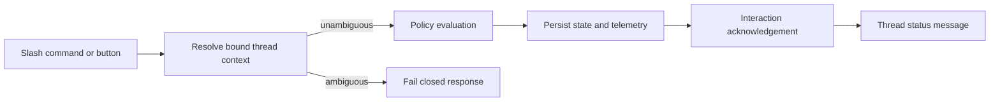

# @vannadii/devplat-discord

Discord control plane workflows.

## Responsibility

This package owns Discord thread sessions, channel bindings, interactive approval requests, and operator control actions. Runtime behavior must resolve bound thread context and fail closed when a lifecycle-changing action is ambiguous.
Slash command and button interactions are routed into control actions, must
resolve exactly one bound thread, and post both interaction acknowledgements and
thread status messages through the Discord REST transport.

## Real-World Flow



## Boundaries

- Keep Discord as an operator control plane, not a source of truth.
- Delegate policy decisions to `@vannadii/devplat-policy`.
- Do not place platform business logic in Discord handlers.

## Development

```bash
npm run test --workspace @vannadii/devplat-discord
```
