# @vannadii/devplat-discord

Discord control plane workflows.

## Responsibility

This package owns Discord thread sessions, channel bindings, interactive
approval requests, the private outbound Discord Gateway interaction runtime,
signature-verified interaction webhook helpers, bound work-item projections, and
operator control actions. Runtime behavior must resolve bound thread context and
fail closed when a lifecycle-changing action is ambiguous. Slash command and
button interactions are received over Discord Gateway by default, routed into
control actions, must resolve exactly one bound thread or bound thread session,
project that session into a typed spec/implementation/pull-request work item,
render compact operator UI payloads with contextual buttons, and post both
interaction acknowledgements and thread status messages through the structured
Discord REST transport. Interaction acknowledgements are sent before persistence
and audit writes so live button clicks satisfy Discord's prompt response window;
the bound-thread message and audit trail are then persisted through the same
control result. If Discord rejects the initial acknowledgement, the action fails
closed, skips lifecycle state writes, writes an audit event, and exposes
`responsePostError`. If the bound-thread status post fails after acknowledgement,
the result preserves the interaction acknowledgement receipt and durable action
record while exposing `threadPostError` for diagnostics. The webhook helper
returns the same structured payload shape for explicit deployments that choose
inbound callbacks, but the production runtime path does not require public
ingress. Route failures and policy denials use standard blocked/refused messages
and still write audit records. The exported
command contract registry is the source for guild slash-command registration.
The live lab registers those commands and includes a Discord callback-shaped
interaction probe so this response path is validated from raw slash-command
payload normalization through operator-visible Discord messages, not only local
unit tests. The live-lab probe fails if the acknowledgement or thread message
loses the structured button rows, posts those component-bearing payloads, and
records the message ids, content, and component custom ids in the live-lab report
for audit review while the private Gateway runtime is still alive. The live-lab
`operator_hold_ms` input can keep that runtime open briefly for manual click
acceptance. Bootstrap/progress status posts remain noninteractive so they do not
leave stale buttons after the ephemeral runner exits. Discord does not provide a
supported bot API for clicking buttons as a human user, so live human clicks in
the sandbox guild remain a manual acceptance check.
Hermetic OpenClaw deep tests use the exported loopback response transport to
verify the same callback-shaped interaction flow without external Discord
access.

## Real-World Flow

```mermaid
flowchart LR
  Contract[Command contract registry] --> Register[Guild command registration]
  Register --> Gateway[Outbound Discord Gateway session]
  Gateway --> Command[INTERACTION_CREATE dispatch]
  Command --> Normalize[Normalize callback payload]
  Normalize --> Binding[Resolve bound thread session]
  Binding --> WorkItem[Project bound work item]
  WorkItem -->|unambiguous| Policy[Policy evaluation]
  Binding -->|ambiguous| Deny[Fail closed response and audit]
  Policy --> Render[Render compact operator UI]
  Render --> Components[Contextual buttons]
  Components --> Response[Interaction acknowledgement over REST]
  Response --> State[Persist state telemetry and audit]
  State --> Thread[Thread status message]
```



## Boundaries

- Keep Discord as an operator control plane, not a source of truth.
- Delegate policy decisions to `@vannadii/devplat-policy`.
- Do not place platform business logic in Discord handlers.

- Keep public TypeScript contracts derived from the exported codecs.

## Development

```bash
npm run test --workspace @vannadii/devplat-discord
```
