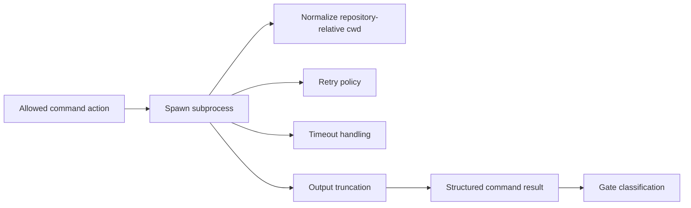

# @vannadii/devplat-execution

Subprocess execution runtime.

## Responsibility

This package owns structured command execution, repository-relative working-directory normalization, timeout handling, captured output, and command result normalization for gate and supervisor flows.

## Real-World Flow



## Boundaries

- Keep command execution deterministic and auditable.
- Do not decide whether privileged commands are allowed; use policy before execution.
- Reject absolute or repository-escaping working directories before execution.
- Keep command result and execution-policy types derived from the exported codecs.
- Keep cwd normalization, truncation, retry, and timeout behavior covered by tests.

## Development

```bash
npm run test --workspace @vannadii/devplat-execution
```
