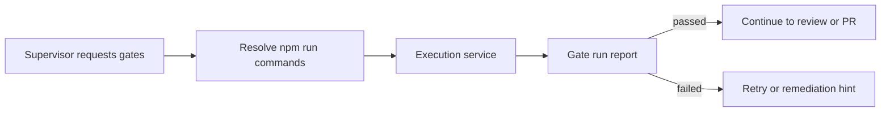

# @vannadii/devplat-gates

Quality gate orchestration.

## Responsibility

This package owns gate command resolution, gate-run reports, pass/fail classification, and next-action hints for the autonomous development cycle.

## Real-World Flow



## Boundaries

- Use `@vannadii/devplat-execution` for command execution.
- Do not own remediation planning or GitHub status publication.
- Keep gate names and reports stable for OpenClaw and Discord callers.

- Keep public TypeScript contracts derived from the exported codecs.

## Development

```bash
npm run test --workspace @vannadii/devplat-gates
```
