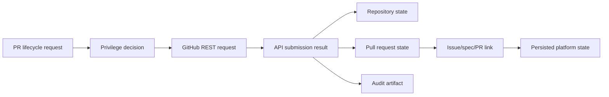

# @vannadii/devplat-github

GitHub-native integration contracts.

## Responsibility

This package owns GitHub action request normalization, repository state projection, pull request state projection, issue/spec/PR links, and submission decisions for repository operations such as branch sync, pull request update, merge, and workflow dispatch. GitHub action constants re-export the shared action vocabulary from `@vannadii/devplat-core` so policy and GitHub routes cannot drift.
Allowed actions are projected into concrete GitHub REST requests for PR
creation, PR updates, PR comments, PR merges, and branch synchronization.

## Real-World Flow



## Boundaries

- Keep GitHub as the source of truth for specs, PRs, reviews, and merge history.
- Delegate privilege checks to `@vannadii/devplat-policy`.
- Normalize repository, pull request, and issue/spec/PR state here before Discord or OpenClaw surfaces render it.
- Do not put Discord or OpenClaw-specific behavior in this package.

- Keep public TypeScript contracts derived from the exported codecs.

## Development

```bash
npm run test --workspace @vannadii/devplat-github
```
