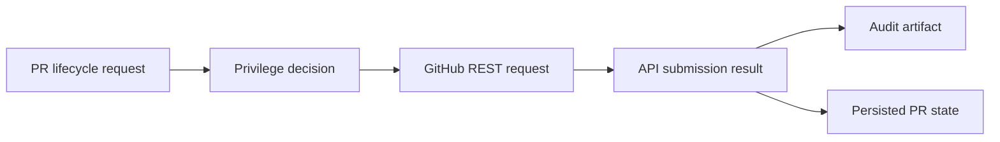

# @vannadii/devplat-github

GitHub-native integration contracts.

## Responsibility

This package owns GitHub action request normalization and submission decisions for repository operations such as branch sync, pull request update, merge, and workflow dispatch.
Allowed actions are projected into concrete GitHub REST requests for PR
creation, PR updates, PR comments, PR merges, and branch synchronization.

## Real-World Flow



## Boundaries

- Keep GitHub as the source of truth for specs, PRs, reviews, and merge history.
- Delegate privilege checks to `@vannadii/devplat-policy`.
- Do not put Discord or OpenClaw-specific behavior in this package.

- Keep public TypeScript contracts derived from the exported codecs.

## Development

```bash
npm run test --workspace @vannadii/devplat-github
```
