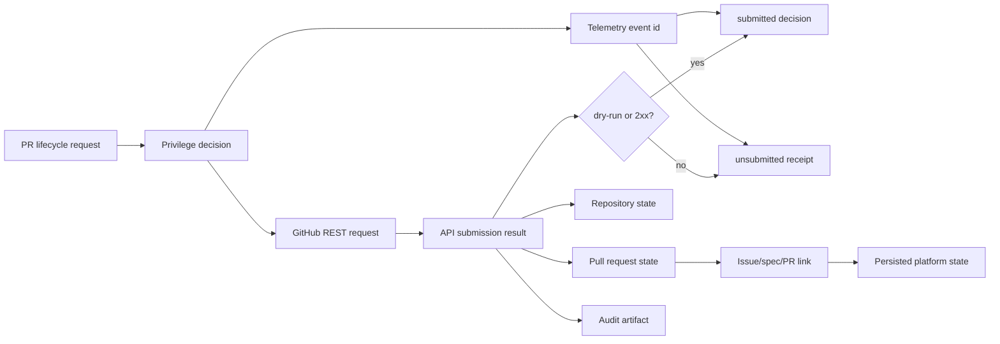

# @vannadii/devplat-github

GitHub-native integration contracts.

## Responsibility

This package owns GitHub action request normalization, repository state projection, pull request state projection, issue/spec/PR links, and submission decisions for repository operations such as branch sync, pull request update, merge, and workflow dispatch. GitHub action constants re-export the shared action vocabulary from `@vannadii/devplat-core` so policy and GitHub routes cannot drift.
Allowed actions are projected into concrete GitHub REST requests for PR
creation, PR updates, PR comments, PR merges, and branch synchronization.
Repository snapshots validate default and protected branch refs with the shared
Git branch codec, while pull request snapshots and action requests continue to
share that same branch contract for head/base refs.
Submission receipts classify dry-run and 2xx responses as submitted while
preserving non-2xx GitHub responses as unsubmitted decisions with the original
receipt attached. Every submission decision also returns the telemetry event id
persisted before policy denial or REST submission, so OpenClaw and Discord
operators can link PR updates and merge attempts back to the durable GitHub
workflow audit trail.

## Real-World Flow



## Boundaries

- Keep GitHub as the source of truth for specs, PRs, reviews, and merge history.
- Delegate privilege checks to `@vannadii/devplat-policy`.
- Normalize repository, pull request, and issue/spec/PR state here before Discord or OpenClaw surfaces render it.
- Do not put Discord or OpenClaw-specific behavior in this package.

- Keep public TypeScript contracts derived from the exported codecs.

## Development

```bash
npm run test --workspace @vannadii/devplat-github
```
