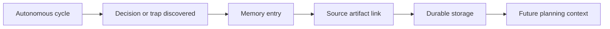

# @vannadii/devplat-memory

Persistent project memory domain contracts.

## Responsibility

This package owns durable memory entries for decisions, constraints, preferences, and known traps that should survive across autonomous development cycles.

## Real-World Flow



## Boundaries

- Store memory through `@vannadii/devplat-storage`.
- Keep source artifact links for auditability.
- Keep memory entry and context bundle types derived from the exported codecs.
- Do not mix transient telemetry with long-lived memory.

## Development

```bash
npm run test --workspace @vannadii/devplat-memory
```
