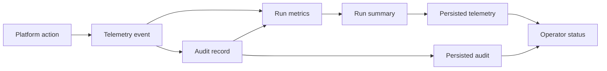

# @vannadii/devplat-observability

Telemetry and traceability contracts.

## Responsibility

This package owns telemetry events, audit records, run metrics, and run-level trace records for platform actions, policy decisions, and autonomous cycle progress.
Telemetry events, audit records, and run summaries validate their persisted
timestamps with the shared ISO timestamp codec so operator status, OpenClaw
telemetry tools, and stored audit evidence use the same timestamp contract.

## Real-World Flow



## Boundaries

- Store telemetry through `@vannadii/devplat-storage`.
- Keep telemetry event, audit record, run metric, and run-summary types derived from the exported codecs.
- Validate telemetry, audit, and run-summary timestamps with the shared core
  codec.
- Store observability audit records in the storage audit scope while artifact-level audit envelopes remain owned by `@vannadii/devplat-artifacts`.
- Do not own external monitoring vendor integration here.

## Development

```bash
npm run test --workspace @vannadii/devplat-observability
```
