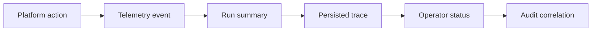

# @vannadii/devplat-observability

Telemetry and traceability contracts.

## Responsibility

This package owns telemetry events and run-level trace records for platform actions, policy decisions, and autonomous cycle progress.

## Real-World Flow



## Boundaries

- Store telemetry through `@vannadii/devplat-storage`.
- Keep audit records separate when they are artifact contracts.
- Do not own external monitoring vendor integration here.

## Development

```bash
npm run test --workspace @vannadii/devplat-observability
```
