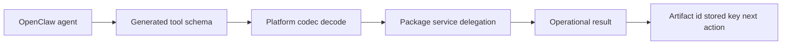

# @vannadii/devplat-openclaw

`@vannadii/devplat-openclaw` is the adapter-only OpenClaw package for DevPlat. It reads generated schemas, decodes tool input with platform codecs, and delegates lifecycle behavior to platform services. GitHub remains the source of truth for specs, pull requests, reviews, and merges; Discord remains the primary operator control plane through OpenClaw.

## Real-World Flow



## Package Assets

- `openclaw.plugin.json`: generated plugin manifest
- `schemas/plugin-config.schema.json`: generated plugin config schema
- `dist/index.js`: built plugin entrypoint

Runtime plugin config includes the Discord category name. Normal production
configuration derives that category from the repository name so one guild can
host multiple repositories without cross-thread ambiguity; OpenClaw test and
live-lab runs set the category to `test`. Plugin config `updatedAt` values are
decoded through the shared ISO timestamp codec before the generated config
schema is accepted. Storage, memory, telemetry, Discord
lifecycle, GitHub submission, pull-request submission, and supervisor-step
tools use the trimmed `DEVPLAT_STORAGE_ROOT` value when it is configured so
live runtime containers and local tool calls read and write the same mounted
`.devplat` state. Pull-request submission also uses trimmed `GITHUB_OWNER` and
`GITHUB_REPO` values so PR updates target the configured repository. Worktree
allocation, sync, release, and dependent rebase tools use the trimmed
`DEVPLAT_WORKTREE_ROOT` value so generated worktree paths stay inside the
configured runtime layout. The worktree lifecycle tools default to pure record
projection; pass `applyToDisk: true` when OpenClaw should delegate to the
Git-backed worktree operations that create, sync, or release the worktree on
disk. Git-backed allocation requires an explicit `baseBranch` so runtime calls
cannot silently fall back to a repository-default branch that may be wrong for
the configured project.
Command execution cwd validation, retry, timeout, and truncation policy are
owned by `@vannadii/devplat-execution`; the OpenClaw tool decodes the
execution-owned option contract, asks policy, delegates execution, records
telemetry, and returns the auditable request snapshot with `timeoutMs`,
`maxOutputBytes`, `retry.attempts`, and the persisted `telemetryEventId`.
Gate execution uses `@vannadii/devplat-gates` for command execution and
classification, then records a telemetry event through the configured
`.devplat` storage root. Pass `actorId` when the gate run is operator-initiated;
otherwise the tool records the OpenClaw runtime as the actor.
Sonar quality-gate evaluation follows the same audit path: it delegates
threshold evaluation to `@vannadii/devplat-sonarcloud`, accepts optional
`actorId`, persists a telemetry event, and returns the telemetry event id with
the quality-gate result.

## Exposed Tools

The plugin registers tools from `createDevplatOpenClawTools()`. Keep new
tool factories in that inventory so the plugin entrypoint, exported package
surface, and tests stay aligned.

- `claim_task` and `update_task` accept an optional current task `record`; pass
  it when OpenClaw already has the stored queue record so lifecycle transitions
  preserve existing status, assignee, trace, and transition history. The
  hermetic deep test exercises this record-preserving path.
- `run_gates`: execute the configured DevPlat gate suite and record telemetry
- `create_research_brief`: normalize a research brief artifact
- `create_spec_record`: normalize a spec record artifact
- `approve_spec_record`: approve a spec record artifact
- `update_spec_record`: create a revised spec artifact with an incremented version
- `create_slice_plan`: create a slice plan
- `evaluate_slice_plan_readiness`: evaluate slice dependencies against completed slices
- `resolve_runtime_config`: normalize runtime configuration
- `create_openclaw_plugin_config`: generate OpenClaw plugin configuration payload
- `create_artifact_envelope`: create a generic artifact envelope
- `create_approval_record`: create an approval record artifact
- `create_audit_log`: create an audit log artifact
- `create_merge_decision`: create a merge decision artifact
- `create_rebase_result`: create a rebase result artifact
- `execute_command`: run a repository command through the execution service with optional cwd, timeout, truncation, and retry-attempt controls
- `allocate_worktree`: allocate a tracked worktree, optionally materializing it on disk with `applyToDisk`
- `sync_worktree`: sync an allocated worktree against its base branch, optionally applying the Git operation with `applyToDisk`
- `release_worktree`: release an allocated worktree with an explicit cleanup strategy, optionally applying cleanup with `applyToDisk`
- `bind_discord_thread`: persist Discord thread bindings
- `open_discord_thread`: normalize Discord thread session state
- `handle_discord_approval`: process Discord approval input
- `handle_discord_control`: process Discord control requests or operator
  interaction callbacks through the Discord control plane; hermetic deep-test
  runs use the Discord loopback response transport so callback-shaped input is
  validated without network access
- `verify_sonar_bootstrap`: validate Sonar bootstrap requirements
- `evaluate_sonar_quality_gate`: interpret Sonar quality gate results and
  persist telemetry for the evaluated project, status, coverage, blocking
  issues, actor, and next action
- `create_review_finding`: create a review finding artifact
- `create_remediation_plan`: create a remediation plan artifact
- `remember_memory_entry`: normalize and persist memory entry state
- `evaluate_policy_action`: evaluate lifecycle action policy with risk,
  escalation, audit reason, privilege, and next-action metadata
- `record_telemetry_event`: create telemetry records
- `create_task_record`: create a queue task record
- `claim_task`: claim a queued task
- `update_task`: update task lifecycle state
- `read_stored_record`: fetch a record from the storage adapter
- `list_stored_records`: enumerate storage records
- `read_stored_index`: fetch a secondary storage index entry
- `read_indexed_record`: resolve a secondary storage index to its record
- `list_stored_index`: enumerate secondary storage index keys
- `store_record`: persist a record through the storage adapter
- `create_pull_request_record`: create a pull request record
- `submit_pull_request_update`: update a pull request record and surface the
  delegated GitHub workflow telemetry event id
- `submit_pull_request_merge`: submit a merge-ready pull request decision and
  surface the delegated GitHub workflow telemetry event id
- `plan_rebase_dependents`: plan dependent rebases
- `execute_rebase_dependents`: execute dependent branch refreshes through
  worktree sync flows and preserve detected conflict classification from the
  delegated branching package
- `create_github_action_request`: create a GitHub action request
- `submit_github_action`: submit a GitHub action request result
- `validate_artifact`: validate artifact payloads against platform contracts and optional active repository registry constraints; required-migration failures preserve structured diagnostics, including ordered migration ids when the registry can bridge the stale artifact version to the current version
- `run_supervisor_step`: run a supervisor orchestration step

## Deterministic Generation

The OpenClaw manifest is generated from committed package metadata and the generated plugin config schema:

```bash
npm run generate:openclaw-manifest
npm run check:openclaw-manifest
```

- Keep public TypeScript contracts derived from the exported codecs.

## Development

```bash
nvm use
npm ci
npm run prepare:generated
npm run build
```
