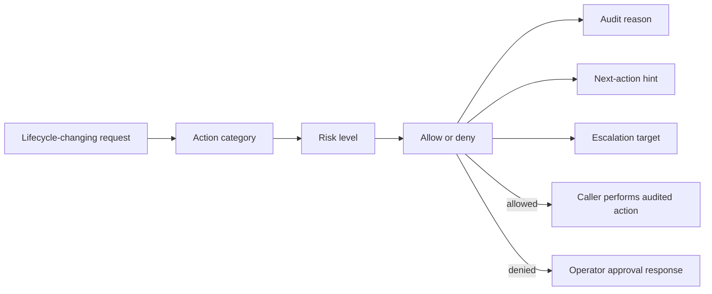

# @vannadii/devplat-policy

Governance and lifecycle action policy.

## Responsibility

This package owns allow/deny decisions, action categories, risk levels, escalation targets, approval requirements, audit requirements, and privilege levels for lifecycle-changing actions such as merge, command execution, worktree release, rebase, publish, autofix, and destructive cleanup.

## Real-World Flow



## Boundaries

- Keep policy deterministic and testable.
- Do not perform the requested action from policy code.
- Return explicit denial reasons, escalation guidance, next-action hints, and audit reasons for Discord, OpenClaw, and audit artifacts.

- Keep public TypeScript contracts derived from the exported codecs.

## Development

```bash
npm run test --workspace @vannadii/devplat-policy
```
