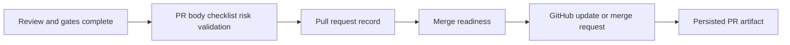

# @vannadii/devplat-prs

Pull request lifecycle management contracts.

## Responsibility

This package owns pull request records, update submission semantics, merge readiness, and PR-facing projections for the autonomous delivery cycle.

## Real-World Flow



## Boundaries

- Keep GitHub API transport in `@vannadii/devplat-github` where possible.
- Use policy before merge or update submission.
- Do not infer Discord thread context here.

## Development

```bash
npm run test --workspace @vannadii/devplat-prs
```
