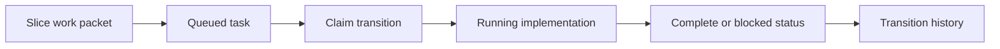

# @vannadii/devplat-queue

Task queue lifecycle state machine.

## Responsibility

This package owns task records, claim transitions, lifecycle updates, and transition history for spec and slice work.
Durable task records and transition events validate `updatedAt` and
`occurredAt` through the shared ISO timestamp codec so queue state, OpenClaw
task tools, and persisted artifacts agree on timestamp shape.

## Real-World Flow



## Boundaries

- Keep task state independent of Discord message formatting.
- Persist durable state through storage-facing callers.
- Keep task record and transition-event types derived from the exported codecs.
- Validate task record and transition timestamps with the shared core codec.
- Do not allocate worktrees directly from queue logic.

## Development

```bash
npm run test --workspace @vannadii/devplat-queue
```
