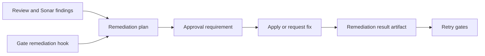

# @vannadii/devplat-remediation

Remediation planning contracts.

## Responsibility

This package owns remediation plans from review findings and gate remediation
hooks, including autofix eligibility, package-owned remediation next-action
constants, unresolved issue summaries, and shared retry-gate recommendations.

## Real-World Flow



## Boundaries

- Consume review and Sonar findings as inputs.
- Consume gate remediation hooks emitted by `@vannadii/devplat-gates`.
- Do not execute fixes directly.
- Keep remediation plan, result, and summary types derived from the exported codecs.
- Keep remediation outputs artifact-ready and auditable.

## Development

```bash
npm run test --workspace @vannadii/devplat-remediation
```
