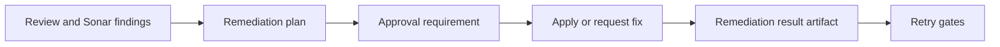

# @vannadii/devplat-remediation

Remediation planning contracts.

## Responsibility

This package owns remediation plans from review findings, including autofix eligibility, unresolved issue summaries, and next-step recommendations.

## Real-World Flow



## Boundaries

- Consume review and Sonar findings as inputs.
- Do not execute fixes directly.
- Keep remediation outputs artifact-ready and auditable.

## Development

```bash
npm run test --workspace @vannadii/devplat-remediation
```
