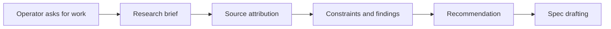

# @vannadii/devplat-research

Research-backed discovery flows.

## Responsibility

This package owns research briefs, source attribution, constraints, findings, and recommendations that feed specification drafting.

## Real-World Flow



## Boundaries

- Keep research artifacts structured and source-linked.
- Keep research brief and attribution types derived from the exported codecs.
- Do not approve specs or create implementation tasks here.
- Keep brief output compatible with artifact validation.

## Development

```bash
npm run test --workspace @vannadii/devplat-research
```
