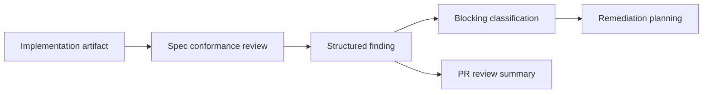

# @vannadii/devplat-review

Automated review engine contracts.

## Responsibility

This package owns structured review findings, severity, blocking status, rationale, and fix recommendations for spec-vs-implementation and quality review flows.

## Real-World Flow



## Boundaries

- Produce findings; do not apply fixes.
- Keep review output compatible with remediation planning.
- Do not call GitHub review APIs directly from this package.

## Development

```bash
npm run test --workspace @vannadii/devplat-review
```
