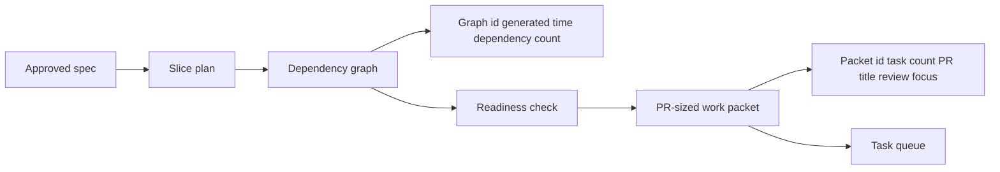

# @vannadii/devplat-slicing

Dependency-aware slice planning.

## Responsibility

This package owns slice plans, dependency graph artifacts, readiness checks, acceptance criteria, and PR-sized work packets derived from approved specs.

## Real-World Flow



## Boundaries

- Keep slice readiness deterministic.
- Do not claim tasks or allocate worktrees here.
- Keep dependency and work-packet metadata usable by queue, PR, review, and branching flows.
- Decode slice `updatedAt` and dependency-graph `generatedAt` values through the shared ISO timestamp codec, and work-packet branch names through the shared Git branch codec.

- Keep public TypeScript contracts derived from the exported codecs.

## Development

```bash
npm run test --workspace @vannadii/devplat-slicing
```
