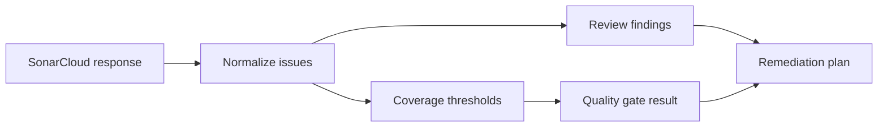

# @vannadii/devplat-sonarcloud

SonarCloud integration and policy interpretation.

## Responsibility

This package owns SonarCloud bootstrap verification, quality gate interpretation, issue normalization, review-finding projection, and coverage threshold decisions. Bootstrap verification inputs, bootstrap results, and quality-gate results use the shared ISO timestamp codec so stale or loosely formatted Sonar evidence cannot enter durable lifecycle state.

## Real-World Flow



## Boundaries

- Keep Sonar result mapping deterministic and testable.
- Do not suppress quality gate failures.
- Feed normalized issues into review and remediation packages.
- Project Sonar issues through `@vannadii/devplat-review` rather than inventing a parallel finding shape.

- Keep public TypeScript contracts derived from the exported codecs.

## Development

```bash
npm run test --workspace @vannadii/devplat-sonarcloud
```
