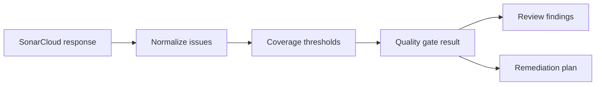

# @vannadii/devplat-sonarcloud

SonarCloud integration and policy interpretation.

## Responsibility

This package owns SonarCloud bootstrap verification, quality gate interpretation, issue normalization, and coverage threshold decisions.

## Real-World Flow



## Boundaries

- Keep Sonar result mapping deterministic and testable.
- Do not suppress quality gate failures.
- Feed normalized issues into review and remediation packages.

## Development

```bash
npm run test --workspace @vannadii/devplat-sonarcloud
```
