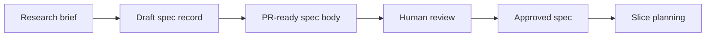

# @vannadii/devplat-specs

Specification lifecycle management.

## Responsibility

This package owns spec records, approval state, revision history, and PR-ready specification rendering for the autonomous planning flow.

## Real-World Flow



## Boundaries

- Keep GitHub as the source of truth for spec PRs.
- Do not slice or execute implementation work here.
- Keep spec artifacts aligned with generated schemas and docs.

## Development

```bash
npm run test --workspace @vannadii/devplat-specs
```
