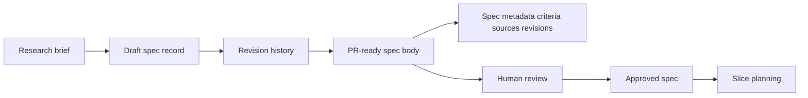

# @vannadii/devplat-specs

Specification lifecycle management.

## Responsibility

This package owns spec records, approval state, revision metadata, source artifact references, and PR-ready specification rendering for the autonomous planning flow.
Spec records and revision-history entries validate `updatedAt` with the shared
ISO timestamp codec so generated schemas, OpenClaw spec tools, and persisted
spec history agree on timestamp shape.

## Real-World Flow



## Boundaries

- Keep GitHub as the source of truth for spec PRs.
- Do not slice or execute implementation work here.
- Validate spec record and revision timestamps with the shared core codec.
- Keep spec artifacts, revision metadata, and rendered PR bodies aligned with generated schemas and docs.

- Keep public TypeScript contracts derived from the exported codecs.

## Development

```bash
npm run test --workspace @vannadii/devplat-specs
```
