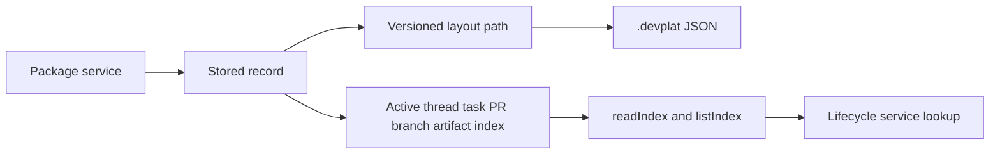

# @vannadii/devplat-storage

Lightweight file-backed adapter over `.devplat`.

## Responsibility

This package owns direct `.devplat` reads and writes, layout versioning, storage
paths, index materialization, and index lookup for active thread, task, pull
request, branch, and artifact lookups.

## Real-World Flow



## Boundaries

- This is the only package that may directly read or write `.devplat` paths.
- Keep storage format auditable JSON.
- Keep stored record, scope, and index-name types derived from the exported codecs.
- Expose index reads through storage APIs instead of direct path access.
- Do not own lifecycle transitions for stored domain records.

## Development

```bash
npm run test --workspace @vannadii/devplat-storage
```
