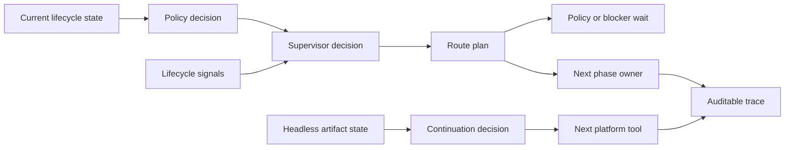

# @vannadii/devplat-supervisor

Lifecycle orchestration brain.

## Responsibility

This package owns deterministic supervisor decisions and lifecycle routing
across research, specs, slicing, implementation, gates, review, remediation,
merge, and continuation. Route owners, phase order, and action keyword
vocabulary live in `constants.ts` so classifier behavior is shared, named, and
testable.

Headless continuation requests let agents continue software-building work
without Discord thread state. A request supplies the repository key, objective,
actor, timestamp, and known lifecycle artifacts; the supervisor returns the
next concrete platform tool, phase, route owner, required inputs, blockers, and
artifact gaps. The decision stays deterministic and auditable while OpenClaw,
CLI scripts, GitHub Actions, or another caller performs the side effects.

## Real-World Flow



## Boundaries

- Use policy decisions as inputs for privileged actions.
- Preserve lifecycle signals, blockers, artifact IDs, and route audit reasons on supervisor decisions.
- Do not own OpenClaw agent execution; OpenClaw remains the agent loop.
- Keep outputs auditable and artifact-friendly.
- Decode supervisor decision `updatedAt` values through the shared ISO timestamp codec.
- Treat Discord as optional context for continuation; repository and artifact
  state are enough to choose the next headless action.

- Keep public TypeScript contracts derived from the exported codecs.

## Development

```bash
npm run test --workspace @vannadii/devplat-supervisor
```
