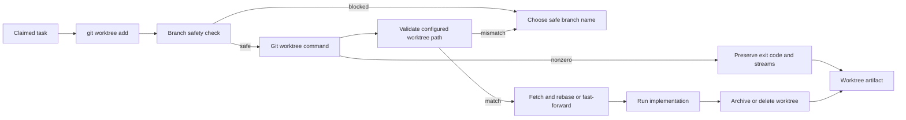

# @vannadii/devplat-worktrees

Worktree allocation and synchronization contracts.

## Responsibility

This package owns worktree allocation, sync, release semantics, branch safety, and cleanup result modeling for task execution.
The service exposes pure record helpers and Git-backed async methods for
`git worktree add`, fetch/rebase or fast-forward sync, and archive/delete
release behavior. Branch names are evaluated before any Git command runs, and
unsafe names produce blocked records with next-action hints.
Git-backed sync and release also recompute the deterministic worktree path from
the configured worktree root, task id, and branch name; caller-provided
allocation records with mismatched paths are blocked before any Git command can
run.
Git command failures preserve the child-process exit code and captured
stdout/stderr so gate output and operator diagnostics can point at the real
failure.
Persisted allocation, sync, and release records require ISO-8601 millisecond
timestamps, and sync result contracts validate `baseBranch` with the shared Git
branch codec while still preserving unsafe operator-provided branch input on
blocked audit records.

## Real-World Flow



## Boundaries

- Keep Git worktree behavior here.
- Fail closed before Git execution when branch names are unsafe.
- Validate persisted lifecycle timestamps and sync base refs with shared core
  codecs.
- Require policy mediation before destructive release actions.
- Do not submit GitHub pull request updates directly.

- Keep public TypeScript contracts derived from the exported codecs.

## Development

```bash
npm run test --workspace @vannadii/devplat-worktrees
```
