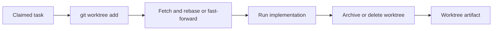

# @vannadii/devplat-worktrees

Worktree allocation and synchronization contracts.

## Responsibility

This package owns worktree allocation, sync, release semantics, branch safety, and cleanup result modeling for task execution.
The service exposes pure record helpers and Git-backed async methods for
`git worktree add`, fetch/rebase or fast-forward sync, and archive/delete
release behavior.

## Real-World Flow



## Boundaries

- Keep Git worktree behavior here.
- Require policy mediation before destructive release actions.
- Do not submit GitHub pull request updates directly.

## Development

```bash
npm run test --workspace @vannadii/devplat-worktrees
```
