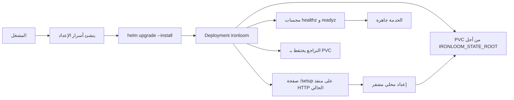

# النشر

صورة وقت التشغيل هي `ghcr.io/vannadii/ironloom` ما لم يتغير مالك السجل. ينشر Helm chart الملف الثنائي `ironloom` مع حالة `.ironloom` مدعومة بـ PVC، وتهيئة محلية مشفرة وقت الإعداد، ومراجع أسرار اختيارية لبيانات اعتماد Discord وGitHub وSonarCloud وOpenAI، ومجسات الصحة والجاهزية.

استخدم Helm chart تحت `deploy/helm/ironloom` لنشر k3s.

## تدفق النشر



## أسرار وقت التشغيل

أنشئ سر الإعداد في مساحة الاسم الهدف قبل تثبيت chart. يجب أن يكون `IRONLOOM_CONFIG_KEY` مادة مفتاح 32 بايت بترميز Base64. يخول `IRONLOOM_INSTALLER_TOKEN` إرسالات نموذج إعداد التشغيل الأول.

```sh
kubectl create namespace ironloom
kubectl -n ironloom create secret generic ironloom-setup \
  --from-literal=config-key="$(openssl rand -base64 32)" \
  --from-literal=installer-token="$(openssl rand -base64 32)"
```

يمكن توفير بيانات اعتماد وقت التشغيل عبر أسرار Kubernetes أو صفحة الإعداد أو كليهما. تتقدم الأسرار المربوطة بالبيئة على قيم الإعداد المحلي المشفرة.

```sh
kubectl -n ironloom create secret generic ironloom-discord \
  --from-literal=application-id="${IRONLOOM_DISCORD_APPLICATION_ID}" \
  --from-literal=token="${IRONLOOM_DISCORD_TOKEN}" \
  --from-literal=public-key="${IRONLOOM_DISCORD_PUBLIC_KEY}"
kubectl -n ironloom create secret generic ironloom-github \
  --from-literal=token="${IRONLOOM_GITHUB_TOKEN}"
kubectl -n ironloom create secret generic ironloom-sonarcloud \
  --from-literal=token="${IRONLOOM_SONARCLOUD_TOKEN}"
kubectl -n ironloom create secret generic ironloom-openai \
  --from-literal=api-key="${IRONLOOM_OPENAI_API_KEY}"
```

بالنسبة لتفويض Discord، وفر `IRONLOOM_DISCORD_APPLICATION_ID` من خلال مفتاح السر `application-id` أو قيمة Helm `--set-string discord.applicationId=...`. بالنسبة لمصادقة OpenAI، وفر `IRONLOOM_OPENAI_API_KEY` أو `IRONLOOM_OPENAI_OAUTH_SESSION`. تدعم صفحة الإعداد كلا النمطين أيضا.

## تجربة k3s الجافة

شغل تجربة جافة من جهة الخادم قبل تغيير العنقود.

```sh
helm upgrade --install ironloom deploy/helm/ironloom \
  --namespace ironloom \
  --create-namespace \
  --dry-run=server
```

## قبول k3s المحلي

شغل وصفة القبول المحلية المؤقتة قبل نشر تغييرات chart أو ترقيتها.

```sh
just k3s-acceptance
```

تبني الوصفة `ironloom:local`، وتشغل عنقود k3s مؤقتا مدعوما بـ Docker، وتنشئ أسرار setup وruntime، وتثبت Helm chart، وتتحقق من ping وأمر Discord الموقعين عبر `/discord/interactions`، ثم تعيد تشغيل Deployment لإثبات بقاء فهرس قطع thread الأثرية المدعوم بـ PVC. يعاد توجيه وقت التشغيل افتراضيا على `127.0.0.1:18081`؛ اضبط `IRONLOOM_K3S_HTTP_PORT` عندما يكون هذا المنفذ غير متاح. تستخدم builds المحلية للصورة host networking افتراضيا؛ اضبط `IRONLOOM_DOCKER_BUILD_NETWORK=default` لاستخدام شبكة build الافتراضية في Docker.

## probe خارجي مباشر

بعد ربط بيانات اعتماد وقت التشغيل الحقيقية، شغل probe الخارجي للتحقق من قراءات GitHub كمصدر للحقيقة واستطلاع quality gate في SonarCloud.

```sh
IRONLOOM_GITHUB_REPOSITORY=VannaDii/ironloom just external-probe
```

يستخدم الأمر قيم بيئة وقت التشغيل `IRONLOOM_*` نفسها التي يستخدمها service، ويطبع ملخص JSON منقحا لإسقاط مستودع GitHub وحالة quality gate في SonarCloud وعدد المشكلات غير المحلولة.

## التثبيت أو الترقية

ثبت من chart المحلي أثناء التحقق، أو من OCI chart المنشور بعد نشر الإصدار.

```sh
helm upgrade --install ironloom deploy/helm/ironloom \
  --namespace ironloom \
  --create-namespace \
  --set image.repository=ghcr.io/vannadii/ironloom \
  --set image.tag=0.1.0
```

```sh
helm upgrade --install ironloom oci://ghcr.io/vannadii/charts/ironloom \
  --namespace ironloom \
  --create-namespace \
  --version 0.1.0
```

## فحوصات الدخان

```sh
kubectl -n ironloom rollout status deployment/ironloom
kubectl -n ironloom port-forward service/ironloom 8080:8080
curl -fsS http://127.0.0.1:8080/healthz
curl -fsS http://127.0.0.1:8080/readyz
cargo test -p ironloom-runtime --test vertical_slice
```

## التراجع

احتفظ بـ PVC ما لم يوافق المشغل صراحة على تنظيف هدمي.

```sh
helm -n ironloom history ironloom
helm -n ironloom rollback ironloom <revision>
kubectl -n ironloom rollout status deployment/ironloom
```

## نشر الموقع

ينشر `.github/workflows/docs-deploy.yml` موقع VitePress إلى GitHub Pages عند `https://ironloom.dev` على `main`.
