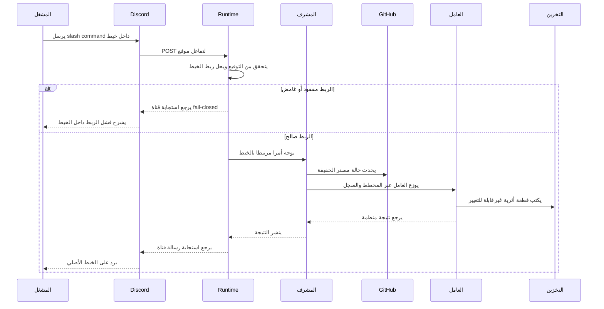

# سير عمل المشغل

يجب أن ترتبط إجراءات Discord التي تغير دورة الحياة بعنصر عمل وخيط محفوظين بالضبط. يفشل سياق الخيط المفقود أو الغامض بشكل مغلق قبل تشغيل أي عامل.

## تسلسل الأوامر

## ربط الخيط

يعامل Ironloom خيط Discord كسياق المشغل. يجب أن يحل الأمر إلى عنصر عمل واحد قبل تشغيل السياسة أو توزيع العمال.

## حالة GitHub

يجب تحديث حالة GitHub قبل قرارات طلبات السحب أو الفروع أو الفحوصات أو المراجعات أو الدمج. يمكن للحالة المخزنة مؤقتا دعم العرض والفهرسة، لكنها ليست مصدر الحقيقة.

## القطع الأثرية

يخزن المشرف القطع الأثرية غير القابلة للتغيير تحت `.ironloom` ويفهرسها حسب الخيط وعنصر العمل. يجب أن تشير الردود الموجهة للمشغل إلى الخيط الأصلي.
