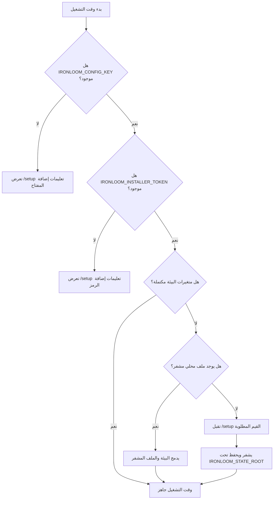

# الإعداد الأولي

يقبل Ironloom قيم الإعداد من متغيرات البيئة ومن ملف إعداد محلي مشفر. تتقدم متغيرات البيئة دائما.

## تدفق حل الإعداد



## متغيرات الإعداد المطلوبة

| المتغير | الغرض |
| --- | --- |
| `IRONLOOM_CONFIG_KEY` | مفتاح 32 بايت بترميز Base64 يستخدم لتشفير وفك تشفير ملف الإعداد المحلي. |
| `IRONLOOM_INSTALLER_TOKEN` | رمز يولده المشغل ومطلوب لإرسال تغييرات الإعداد. |
| `IRONLOOM_STATE_ROOT` | دليل حالة وقت التشغيل الذي يحتوي حالة الإعداد المشفرة وقطع `.ironloom` الأثرية. |

ولد المفتاح ورمز التثبيت باستخدام:

```sh
openssl rand -base64 32
```

## متغيرات وقت التشغيل

| المتغير | الغرض |
| --- | --- |
| `IRONLOOM_PUBLIC_URL` | عنوان URL الأساسي العام لوقت التشغيل. |
| `IRONLOOM_DISCORD_APPLICATION_ID` | معرف تطبيق Discord المستخدم لبناء عنوان تفويض الخادم. |
| `IRONLOOM_DISCORD_TOKEN` | رمز Discord أو مرجع سر. |
| `IRONLOOM_DISCORD_PUBLIC_KEY` | مفتاح Discord العام أو مرجع سر. |
| `IRONLOOM_GITHUB_TOKEN` | رمز GitHub أو مرجع سر. |
| `IRONLOOM_SONARCLOUD_TOKEN` | رمز SonarCloud أو مرجع سر. |
| `IRONLOOM_SONARCLOUD_ORGANIZATION` | مؤسسة SonarCloud. |
| `IRONLOOM_SONARCLOUD_PROJECT_KEY` | مفتاح مشروع SonarCloud. |
| `IRONLOOM_OPENAI_API_KEY` | مفتاح OpenAI API لمصادقة API key. |
| `IRONLOOM_OPENAI_OAUTH_SESSION` | مرجع جلسة OpenAI OAuth لمصادقة OAuth. |

وفر إما `IRONLOOM_OPENAI_API_KEY` أو `IRONLOOM_OPENAI_OAUTH_SESSION`.

## تفويض Discord

أنشئ تطبيق Discord في Discord Developer Portal وانسخ معرف التطبيق إلى `IRONLOOM_DISCORD_APPLICATION_ID` أو صفحة setup. تستطيع صفحة setup إنشاء عنوان تفويض Discord بنطاقي `bot` و`applications.commands` حتى يتمكن مسؤول الخادم من تثبيت Ironloom في الخادم الهدف.

احتفظ برمز bot الخاص ب Discord والمفتاح العام في متغيرات البيئة أو bindings الأسرار عندما يكون ذلك ممكنا. إذا أدخلت عبر `/setup`، يحفظها Ironloom في ملف setup المحلي المشفر.

## الإعداد المحلي المشفر

عندما لا تكون قيم وقت التشغيل المطلوبة موجودة في البيئة، يقبل `/setup` هذه القيم بعد توفير رمز التثبيت. يكتب Ironloom حالة الإعداد المشفرة إلى:

```text
${IRONLOOM_STATE_ROOT}/setup/config.enc.json
```

يشفر الملف باستخدام AES-GCM ويكتب بأذونات للمالك فقط على أنظمة Unix.

## الأولوية

حل التهيئة هو:

1. متغير البيئة.
2. ملف الإعداد المشفر تحت `IRONLOOM_STATE_ROOT`.
3. خطأ تهيئة مفقودة.

يسمح ذلك لأسرار Kubernetes وDocker بتجاوز الحالة المحلية دون حذف ملف الإعداد المشفر.
