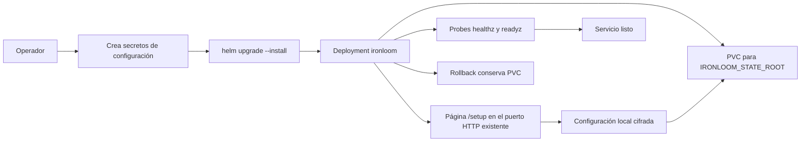

# Despliegue

La imagen de runtime es `ghcr.io/vannadii/ironloom` salvo que cambie el propietario del registro. El chart Helm despliega el binario `ironloom` con estado `.ironloom` respaldado por PVC, configuración local cifrada durante setup, referencias opcionales de secretos para credenciales de Discord, GitHub, SonarCloud y OpenAI, y probes de health/readiness.

Usa el chart Helm bajo `deploy/helm/ironloom` para despliegues en k3s.

## Flujo de despliegue



## Secretos de runtime

Crea el secreto de setup en el namespace destino antes de instalar el chart. `IRONLOOM_CONFIG_KEY` debe ser material de clave de 32 bytes codificado en Base64. `IRONLOOM_INSTALLER_TOKEN` autoriza envíos del formulario de configuración inicial.

```sh
kubectl create namespace ironloom
kubectl -n ironloom create secret generic ironloom-setup \
  --from-literal=config-key="$(openssl rand -base64 32)" \
  --from-literal=installer-token="$(openssl rand -base64 32)"
```

Las credenciales de runtime pueden entregarse mediante secretos de Kubernetes, la página de configuración o ambos. Los secretos enlazados por entorno tienen precedencia sobre valores locales cifrados.

```sh
kubectl -n ironloom create secret generic ironloom-discord \
  --from-literal=application-id="${IRONLOOM_DISCORD_APPLICATION_ID}" \
  --from-literal=token="${IRONLOOM_DISCORD_TOKEN}" \
  --from-literal=public-key="${IRONLOOM_DISCORD_PUBLIC_KEY}"
kubectl -n ironloom create secret generic ironloom-github \
  --from-literal=token="${IRONLOOM_GITHUB_TOKEN}"
kubectl -n ironloom create secret generic ironloom-sonarcloud \
  --from-literal=token="${IRONLOOM_SONARCLOUD_TOKEN}"
kubectl -n ironloom create secret generic ironloom-openai \
  --from-literal=api-key="${IRONLOOM_OPENAI_API_KEY}"
```

Para autorización de Discord, proporciona `IRONLOOM_DISCORD_APPLICATION_ID` mediante la clave secreta `application-id` o el valor Helm `--set-string discord.applicationId=...`. Para autenticación de OpenAI, proporciona `IRONLOOM_OPENAI_API_KEY` o `IRONLOOM_OPENAI_OAUTH_SESSION`. La página de configuración también admite ambos modos.

## Dry run de k3s

Ejecuta un dry run del lado del servidor antes de cambiar el cluster.

```sh
helm upgrade --install ironloom deploy/helm/ironloom \
  --namespace ironloom \
  --create-namespace \
  --dry-run=server
```

## Aceptación local de k3s

Ejecuta la receta de aceptación local desechable antes de publicar o promover cambios del chart.

```sh
just k3s-acceptance
```

La receta construye `ironloom:local`, inicia un cluster k3s desechable respaldado por Docker, crea secretos de setup y runtime, instala el chart Helm, verifica ping y comando firmados de Discord mediante `/discord/interactions`, y reinicia el Deployment para probar que el índice de artefactos por thread respaldado por PVC persiste. Reenvía el runtime en `127.0.0.1:18081` de forma predeterminada; usa `IRONLOOM_K3S_HTTP_PORT` cuando ese puerto no esté disponible. Las builds locales de imagen usan la red del host de forma predeterminada; define `IRONLOOM_DOCKER_BUILD_NETWORK=default` para usar la red de build predeterminada de Docker.

## Probe externo en vivo

Después de enlazar credenciales reales del runtime, ejecuta el probe externo para verificar lecturas fuente de verdad de GitHub y polling del quality gate de SonarCloud.

```sh
IRONLOOM_GITHUB_REPOSITORY=VannaDii/ironloom just external-probe
```

El comando usa los mismos valores de entorno `IRONLOOM_*` que el servicio e imprime un resumen JSON redactado de la proyección del repositorio GitHub, el estado del quality gate de SonarCloud y el conteo de incidencias sin resolver.

## Instalar o actualizar

Instala desde el chart local durante validación, o desde el chart OCI publicado después de la publicación de la release.

```sh
helm upgrade --install ironloom deploy/helm/ironloom \
  --namespace ironloom \
  --create-namespace \
  --set image.repository=ghcr.io/vannadii/ironloom \
  --set image.tag=0.1.0
```

```sh
helm upgrade --install ironloom oci://ghcr.io/vannadii/charts/ironloom \
  --namespace ironloom \
  --create-namespace \
  --version 0.1.0
```

## Smoke checks

```sh
kubectl -n ironloom rollout status deployment/ironloom
kubectl -n ironloom port-forward service/ironloom 8080:8080
curl -fsS http://127.0.0.1:8080/healthz
curl -fsS http://127.0.0.1:8080/readyz
cargo test -p ironloom-runtime --test vertical_slice
```

## Rollback

Conserva el PVC salvo que un operador apruebe explícitamente la limpieza destructiva.

```sh
helm -n ironloom history ironloom
helm -n ironloom rollback ironloom <revision>
kubectl -n ironloom rollout status deployment/ironloom
```

## Publicación del sitio

`.github/workflows/docs-deploy.yml` publica el sitio VitePress en GitHub Pages en `https://ironloom.dev` desde `main`.
