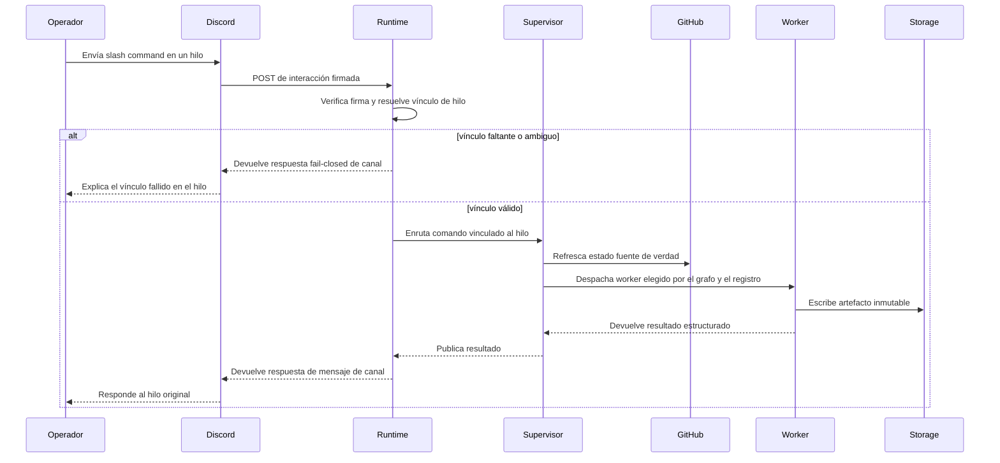

# Flujos de operación

Las acciones de Discord que cambian ciclo de vida deben estar vinculadas exactamente a un work item persistido y a un hilo. Un contexto de hilo faltante o ambiguo falla cerrado antes de que se ejecute cualquier worker.

## Secuencia de comandos

## Vinculación de hilo

Ironloom trata el hilo de Discord como el contexto del operador. Un comando debe resolverse a un único work item antes de ejecutar políticas o despacho de workers.

## Estado de GitHub

El estado de GitHub debe refrescarse antes de decisiones sobre pull requests, ramas, checks, reviews o merges. El estado cacheado puede ayudar con visualización e indexación, pero no es la fuente de verdad.

## Artefactos

El supervisor almacena artefactos inmutables bajo `.ironloom` y los indexa por hilo y work item. Las respuestas para operadores deben apuntar de vuelta al hilo de origen.
