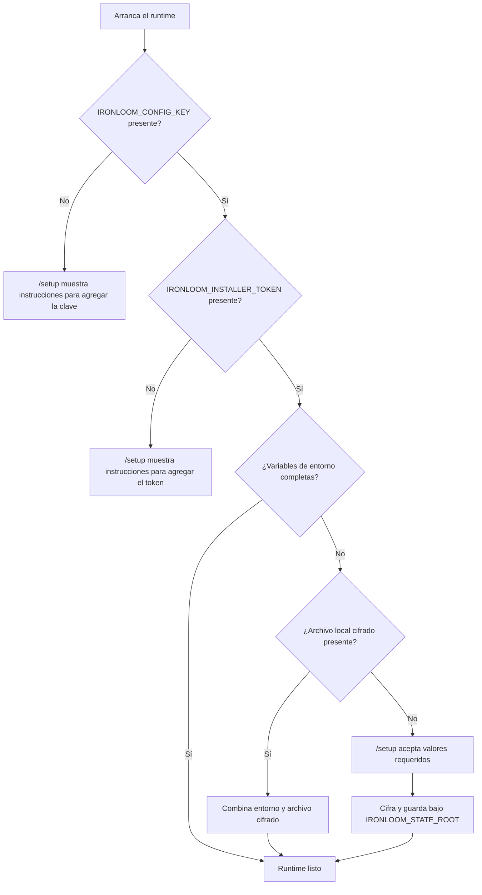

# Configuración inicial

Ironloom acepta valores de configuración desde variables de entorno y desde un archivo local cifrado. Las variables de entorno siempre tienen precedencia.

## Flujo de resolución de configuración



## Variables de configuración requeridas

| Variable | Propósito |
| --- | --- |
| `IRONLOOM_CONFIG_KEY` | Clave de 32 bytes codificada en Base64 usada para cifrar y descifrar el archivo local de configuración. |
| `IRONLOOM_INSTALLER_TOKEN` | Token generado por el operador y requerido para enviar cambios de configuración. |
| `IRONLOOM_STATE_ROOT` | Directorio de estado del runtime que contiene estado de configuración cifrado y artefactos `.ironloom`. |

Genera la clave y el token de instalación con:

```sh
openssl rand -base64 32
```

## Variables de runtime

| Variable | Propósito |
| --- | --- |
| `IRONLOOM_PUBLIC_URL` | URL base pública del runtime. |
| `IRONLOOM_DISCORD_APPLICATION_ID` | ID de la aplicación de Discord usado para construir la URL de autorización del servidor. |
| `IRONLOOM_DISCORD_TOKEN` | Token de Discord o referencia de secreto. |
| `IRONLOOM_DISCORD_PUBLIC_KEY` | Clave pública de Discord o referencia de secreto. |
| `IRONLOOM_GITHUB_TOKEN` | Token de GitHub o referencia de secreto. |
| `IRONLOOM_SONARCLOUD_TOKEN` | Token de SonarCloud o referencia de secreto. |
| `IRONLOOM_SONARCLOUD_ORGANIZATION` | Organización de SonarCloud. |
| `IRONLOOM_SONARCLOUD_PROJECT_KEY` | Clave de proyecto de SonarCloud. |
| `IRONLOOM_OPENAI_API_KEY` | Clave API de OpenAI para autenticación por API key. |
| `IRONLOOM_OPENAI_OAUTH_SESSION` | Referencia de sesión OAuth de OpenAI para autenticación OAuth. |

Proporciona `IRONLOOM_OPENAI_API_KEY` o `IRONLOOM_OPENAI_OAUTH_SESSION`.

## Autorización de Discord

Crea una aplicación de Discord en el Discord Developer Portal y copia su ID de aplicación en `IRONLOOM_DISCORD_APPLICATION_ID` o en la página de setup. La página de setup puede generar una URL de autorización de Discord con los scopes `bot` y `applications.commands` para que un administrador instale Ironloom en el servidor objetivo.

Mantén el token del bot de Discord y la clave pública en variables de entorno o bindings de secretos cuando sea posible. Si se introducen en `/setup`, Ironloom los guarda en el archivo local de setup cifrado.

## Configuración local cifrada

Cuando los valores de runtime requeridos no están presentes en el entorno, `/setup` los acepta después de proporcionar el token de instalación. Ironloom escribe el estado cifrado en:

```text
${IRONLOOM_STATE_ROOT}/setup/config.enc.json
```

El archivo se cifra con AES-GCM y se escribe con permisos solo para el propietario en sistemas Unix.

## Precedencia

La resolución de configuración es:

1. Variable de entorno.
2. Archivo cifrado bajo `IRONLOOM_STATE_ROOT`.
3. Error de configuración faltante.

Esto permite que secretos de Kubernetes y Docker sobrescriban estado local sin borrar el archivo de configuración cifrado.
