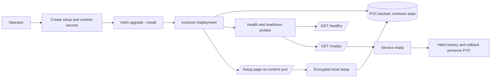

# Deployment

The runtime image is `ghcr.io/vannadii/ironloom` unless the registry owner changes. The Helm chart deploys the `ironloom` binary with PVC-backed `.ironloom` state, setup-time encrypted local configuration, optional secret references for Discord, GitHub, SonarCloud, and OpenAI credentials, and health/readiness probes.

Use the Helm chart under `deploy/helm/ironloom` for k3s deployments.

## Deployment Flow



## Runtime Secrets

Create the setup secret in the target namespace before installing the chart. `IRONLOOM_CONFIG_KEY` must be base64-encoded 32-byte key material. `IRONLOOM_INSTALLER_TOKEN` authorizes first-run setup form submissions.

```sh
kubectl create namespace ironloom
kubectl -n ironloom create secret generic ironloom-setup \
  --from-literal=config-key="$(openssl rand -base64 32)" \
  --from-literal=installer-token="$(openssl rand -base64 32)"
```

Runtime credentials can be provided through Kubernetes secrets, through the setup page, or through both. Environment-bound secrets take precedence over encrypted local setup values.

```sh
kubectl -n ironloom create secret generic ironloom-discord \
  --from-literal=application-id="${IRONLOOM_DISCORD_APPLICATION_ID}" \
  --from-literal=token="${IRONLOOM_DISCORD_TOKEN}" \
  --from-literal=public-key="${IRONLOOM_DISCORD_PUBLIC_KEY}"
kubectl -n ironloom create secret generic ironloom-github \
  --from-literal=token="${IRONLOOM_GITHUB_TOKEN}"
kubectl -n ironloom create secret generic ironloom-sonarcloud \
  --from-literal=token="${IRONLOOM_SONARCLOUD_TOKEN}"
kubectl -n ironloom create secret generic ironloom-openai \
  --from-literal=api-key="${IRONLOOM_OPENAI_API_KEY}"
```

For Discord authorization, provide `IRONLOOM_DISCORD_APPLICATION_ID` through the `application-id` secret key or the Helm value `--set-string discord.applicationId=...`. For OpenAI authentication, provide either `IRONLOOM_OPENAI_API_KEY` or `IRONLOOM_OPENAI_OAUTH_SESSION`. The setup page also supports both modes.

## k3s Dry Run

Run a server-side dry run before changing the cluster.

```sh
helm upgrade --install ironloom deploy/helm/ironloom \
  --namespace ironloom \
  --create-namespace \
  --dry-run=server
```

## Local k3s Acceptance

Run the disposable local acceptance recipe before publishing or promoting chart changes.

```sh
just k3s-acceptance
```

The recipe builds `ironloom:local`, starts a disposable Docker-backed k3s cluster, creates setup and runtime secrets, installs the Helm chart, verifies signed Discord ping and command handling through `/discord/interactions`, and restarts the deployment to prove the PVC-backed thread artifact index persists. It forwards the runtime on `127.0.0.1:18081` by default; set `IRONLOOM_K3S_HTTP_PORT` when that port is unavailable. Local image builds use host networking by default; set `IRONLOOM_DOCKER_BUILD_NETWORK=default` to use Docker's default build network instead.

## Live Discord Endpoint Acceptance

After binding a real Discord application ID, bot token, and public key, run Discord's endpoint validation proof.

```sh
just discord-endpoint-acceptance
```

The recipe starts a local runtime, publishes it through `ngrok`, updates the application's Interactions Endpoint URL, waits for Discord's signed validation `PING`, verifies that Discord persisted the URL, and restores the previous endpoint. Set `IRONLOOM_DISCORD_ACCEPTANCE_ENDPOINT_URL` to validate an already deployed public `/discord/interactions` endpoint instead of starting Docker and `ngrok`.

## Live External Probe

After binding real runtime credentials, run the external probe to verify GitHub source-of-truth reads and SonarCloud quality gate polling.

```sh
IRONLOOM_GITHUB_REPOSITORY=VannaDii/ironloom just external-probe
```

The command uses the same `IRONLOOM_*` runtime environment values as the service and prints a redacted JSON summary of the GitHub repository projection, SonarCloud quality gate status, and unresolved issue count. Set `IRONLOOM_GITHUB_PULL_REQUEST_NUMBER` and `IRONLOOM_GITHUB_CHECK_REF` to include live pull request merge state and check-run reads in the summary.

## Install Or Upgrade

Install from the local chart during validation, or from the published OCI chart after release publication.

```sh
helm upgrade --install ironloom deploy/helm/ironloom \
  --namespace ironloom \
  --create-namespace \
  --set image.repository=ghcr.io/vannadii/ironloom \
  --set image.tag=0.1.0
```

```sh
helm upgrade --install ironloom oci://ghcr.io/vannadii/charts/ironloom \
  --namespace ironloom \
  --create-namespace \
  --version 0.1.0
```

## Smoke Checks

```sh
kubectl -n ironloom rollout status deployment/ironloom
kubectl -n ironloom port-forward service/ironloom 8080:8080
curl -fsS http://127.0.0.1:8080/healthz
curl -fsS http://127.0.0.1:8080/readyz
cargo test -p ironloom-runtime --test vertical_slice
```

## Rollback

Keep the PVC unless an operator explicitly approves destructive cleanup.

```sh
helm -n ironloom history ironloom
helm -n ironloom rollback ironloom <revision>
kubectl -n ironloom rollout status deployment/ironloom
```

## Site Publishing

`.github/workflows/docs-deploy.yml` publishes the VitePress site to GitHub Pages at `https://ironloom.dev` on `main`.
