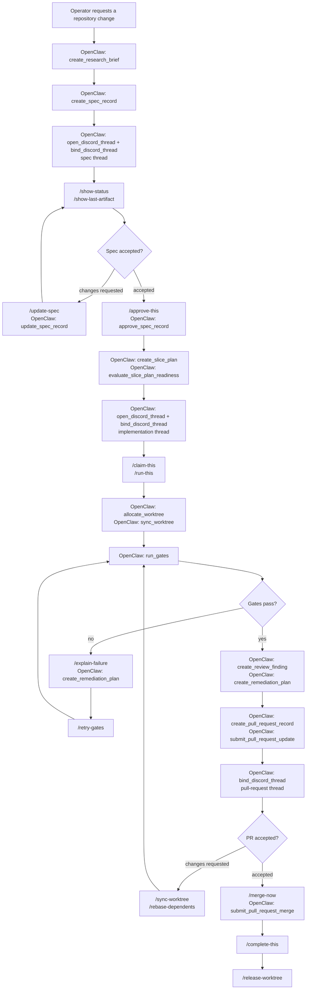

# Operator Guide

## System Roles

- GitHub is the source of truth for specs, pull requests, reviews, approvals, and merge history.
- Discord is the primary operator control plane through OpenClaw.
- SonarCloud provides quality and compliance signals.
- Docker, Helm, and GitHub Pages are the published delivery surfaces.

## Day-0

- build or pull the runtime image
- provide OpenClaw, Discord, GitHub, and Sonar credentials through environment variables, mounted config, or referenced secrets
- for headless software-building loops, provide repository identity, storage root, worktree root, GitHub credentials, and Sonar context; Discord credentials are only required when running the Discord operator surface
- set Discord v10 connection values: API base URL, Gateway URL/intents, application id, public key, bot token, guild id, repository category name, and the standard production spec, implementation, pull-request, audit, and project-management channel ids; production category names default to the repository name for multi-repo guild separation
- start the gateway locally, in Docker, or via Helm on k3s
- complete the live-lab setup guides before dispatching the networked E2E lane

Missing Discord credentials should fail during config load. Do not rely on placeholder values for server connection setup.

## Day-1

- watch GitHub Actions CI, the TypeScript compatibility matrix, Docker, Helm, and docs workflows
- monitor SonarCloud gate status
- use `continue_lifecycle` to choose the next agent-executable platform tool from repository objective and lifecycle artifact state
- verify that operator-visible Discord actions map back to GitHub and artifact state
- run the private Discord Gateway worker with `DISCORD_GATEWAY_ENABLED=true`
  when the runtime should accept real slash commands and button clicks without
  public ingress
- point `DEVPLAT_STORAGE_ROOT` at the same mounted `.devplat` directory used by
  OpenClaw tools so Gateway interaction callbacks can resolve current thread
  bindings
- keep the project-management channel query-only and ensure every result points back to a bound work thread
- rotate credentials through secret references instead of baking them into images
- use the live lab only against the sandbox GitHub org, SonarQube Cloud org, and Discord guild
- expect live-lab and OpenClaw test updates to land in the shared spec, implementation, pull-request, audit, and project-management channels under the `test` Discord category with run labels in every message
- expect the live lab to refresh sandbox guild slash commands before exercising the Discord interaction response path
- expect the live lab to record simulated deferred acknowledgement and completion receipts while posting the operator-visible bound-thread update in the implementation channel

## Commanded Delivery Flow

Bootstrap starts in Discord with `/new-project --repo ... --project ...`.
Discord then drives discovery (`/research`, `/spec`, `/alternatives`,
`/redirect`, `/consider`) and bound spec/implementation/pull-request threads.
Missing or ambiguous bindings must fail closed.

Use `/pause-this` and `/resume-this` to stop or continue automation in any
bound lifecycle thread. Use `/block-this` when a spec, implementation, or
pull-request thread needs explicit operator intervention before it can proceed.
The complete slash-command reference lives in
[Discord Workflows](./discord-workflows.md#operator-actions).

## Discord Operator Messages

Discord messages are operator UI, not log output. Primary messages use this
compact hierarchy: state, scope, item, current result, and contextual controls.
Buttons encode the requested action and thread id, but clicks are revalidated
against the current Discord interaction payload, persisted thread/session
binding, policy decision, and stale-state checks before any platform action is
run.

Route failures use the standard refused message and policy denials use the
standard blocked message. Both persist audit records, and no lifecycle state is
changed for a refused interaction beyond audit logging.

Mutating slash and button actions are role-gated at interaction time using
runtime role bindings (`project-operator`, `spec-approver`, `merge-approver`).
When authorization fails, the refusal message includes caller id, attempted
action, required role, and thread context, and the same reason is written to
durable audit state.

## Recovery

- re-run `npm run prepare:generated` if committed artifacts drift
- use `npm run check:repo` to isolate structure, export, dependency, schema, manifest, instruction, or policy drift
- keep rollback actions tied to GitHub state and documented release notes

## Related Guides

- [Discord Workflows](./discord-workflows.md)
- [Live Test Lab](./live-test-lab.md)
- [Live Test GitHub Setup](./live-test-github-setup.md)
- [Live Test Discord Setup](./live-test-discord-setup.md)
- [Live Test Sonar Setup](./live-test-sonar-setup.md)
- [Live Test Cleanup and Concurrency](./live-test-cleanup-and-concurrency.md)
