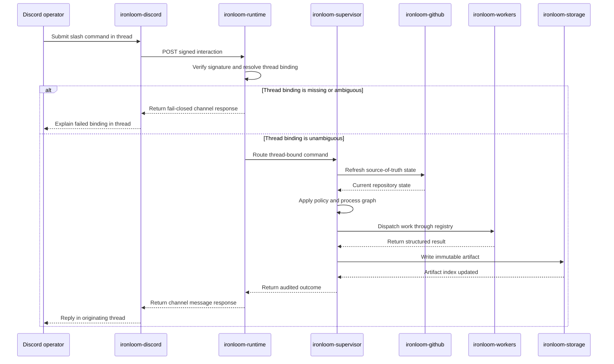

# Operator Workflows

Lifecycle-changing Discord actions must be bound to exactly one persisted work item and thread. Missing or ambiguous thread context fails closed before any worker runs.

## Command Sequence

## Thread Binding

Ironloom treats the Discord thread as the operator context. A command must resolve to a single work item before policy or worker dispatch runs.

## GitHub State

GitHub state should be refreshed before pull request, branch, check, review, or merge decisions. Cached state can support display and indexing, but it is not the source of truth.

## Artifacts

The supervisor stores immutable artifacts under `.ironloom` and indexes them by thread and work item. Operator-facing responses should point back to the originating thread.
