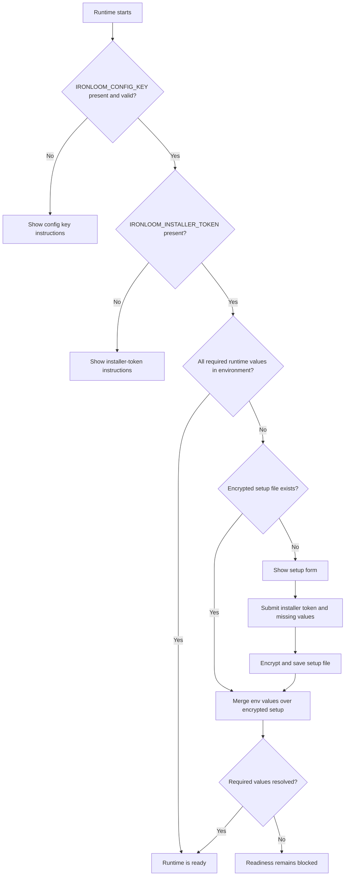

# Initial Setup

Ironloom accepts setup values from environment variables and from an encrypted local setup file. Environment variables always take precedence.

## Setup Resolution Flow



## Required Setup Variables

| Variable | Purpose |
| --- | --- |
| `IRONLOOM_CONFIG_KEY` | Base64-encoded 32-byte key used to encrypt and decrypt the local setup file. |
| `IRONLOOM_INSTALLER_TOKEN` | Operator-generated token required to submit setup changes. |
| `IRONLOOM_STATE_ROOT` | Runtime state directory that contains encrypted setup state and `.ironloom` artifacts. |

Generate the key and installer token with:

```sh
openssl rand -base64 32
```

## Runtime Variables

| Variable | Purpose |
| --- | --- |
| `IRONLOOM_PUBLIC_URL` | Public runtime base URL. |
| `IRONLOOM_DISCORD_APPLICATION_ID` | Discord application ID used to build the server authorization URL. |
| `IRONLOOM_DISCORD_TOKEN` | Discord token or secret reference. |
| `IRONLOOM_DISCORD_PUBLIC_KEY` | Discord public key or secret reference. |
| `IRONLOOM_GITHUB_TOKEN` | GitHub token or secret reference. |
| `IRONLOOM_SONARCLOUD_TOKEN` | SonarCloud token or secret reference. |
| `IRONLOOM_SONARCLOUD_ORGANIZATION` | SonarCloud organization. |
| `IRONLOOM_SONARCLOUD_PROJECT_KEY` | SonarCloud project key. |
| `IRONLOOM_OPENAI_API_KEY` | OpenAI API key for API-key authentication. |
| `IRONLOOM_OPENAI_OAUTH_SESSION` | OpenAI OAuth session reference for OAuth authentication. |

Provide either `IRONLOOM_OPENAI_API_KEY` or `IRONLOOM_OPENAI_OAUTH_SESSION`.

## Discord Authorization

Create a Discord application in the Discord Developer Portal and copy its application ID into `IRONLOOM_DISCORD_APPLICATION_ID` or the setup page. The setup page can then generate a Discord authorization URL with the `bot` and `applications.commands` scopes so a server administrator can install Ironloom into the target server.

Keep the Discord bot token and public key in environment variables or secret bindings when possible. If they are entered through `/setup`, Ironloom stores them in the encrypted local setup file.

## Local Encrypted Setup

When required runtime values are not present in the environment, `/setup` accepts them after the installer token is supplied. Ironloom writes encrypted setup state to:

```text
${IRONLOOM_STATE_ROOT}/setup/config.enc.json
```

The file is encrypted with AES-GCM and written with owner-only permissions on Unix systems.

## Precedence

Configuration resolution is:

1. Environment variable.
2. Encrypted setup file under `IRONLOOM_STATE_ROOT`.
3. Missing configuration error.

This lets Kubernetes and Docker secrets override local state without deleting the encrypted setup file.
