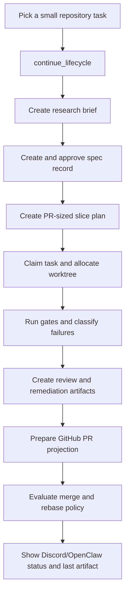

# User Guide

This guide takes a new repository operator from setup to a small validated development cycle. It assumes the single-repository production path: GitHub is the source of truth, Discord is the operator control plane, OpenClaw is the agent loop, and DevPlat owns deterministic state, policy, artifacts, and delivery workflows.

## Setup

1. Install Node from `.nvmrc` and install dependencies.

```bash
nvm use
npm ci
```

2. Configure the repository identity and local runtime roots.

```bash
export GITHUB_OWNER=VannaDii
export GITHUB_REPO=devplat
export GITHUB_DEFAULT_BRANCH=main
export DEVPLAT_STORAGE_ROOT=.devplat
export DEVPLAT_WORKTREE_ROOT=.devplat/worktrees
```

3. Add live integration values only when running the live lab or real operator flow.

```bash
export GITHUB_TOKEN=...
export DISCORD_BOT_TOKEN=...
export DISCORD_APPLICATION_ID=...
export DISCORD_GUILD_ID=...
export DISCORD_OPERATOR_CHANNEL_ID=...
export OPENCLAW_GATEWAY_URL=http://127.0.0.1:3030
export SONAR_TOKEN=...
export SONAR_PROJECT_KEY=...
```

4. Verify the local development surface.

```bash
npm run check:repo
npm run test:openclaw:deep
npm run docs:build
```

## First Software-Building Loop

Use a small spec or implementation request that can be validated without publishing. Start with the headless continuation path so GitHub, OpenClaw, and `.devplat` state drive the loop; Discord can project the same state later when an operator surface is needed.

The command-by-command operator path for the same lifecycle is documented in
the [Operator Guide](./operator-guide.md#commanded-delivery-flow), with the
exact Discord slash-command reference in
[Discord Workflows](./discord-workflows.md#operator-actions).



Run the hermetic cycle first:

```bash
npm run test:openclaw:deep
```

For an agent-driven local cycle, call `continue_lifecycle` with the repository
key, objective, actor, timestamp, and any known artifact signals. The response
names the next platform tool, required inputs, missing artifact types, and any
human approval blocker. After each tool call writes or returns a new lifecycle
artifact, call `continue_lifecycle` again with the updated artifact list.

For repeatable local dogfooding, put the starting request and next-tool inputs
in a JSON plan and run:

```bash
npm run maintenance:headless -- --plan ./maintenance-plan.json --write-plan ./.devplat/state/next-maintenance-plan.json
```

The runner invokes `continue_lifecycle`, executes the next supplied platform
tool input, appends the resulting artifact signal, and repeats until it reaches
a human approval blocker, missing input, a failed tool response, or the step
limit. The optional `--write-plan` target stores the updated continuation
request so a later DevPlat run can resume from the artifact-backed handoff
instead of replaying earlier tool inputs. Use this path to maintain DevPlat from
repository-scoped artifacts before projecting the same state into Discord.

Then run the local workflow simulation before pushing:

```bash
npm run act:pr
npm run act:cleanup
```

The `act` wrapper performs Docker cleanup before and after workflow execution. Run `npm run act:cleanup` again after any interrupted Docker-backed validation.

## Discord Operator Check

For live operator validation, dispatch the live lab with a sandbox Discord guild and ephemeral GitHub repository values. The acceptance path requires command registration plus callback-shaped Discord interaction probing through the real response path.

```bash
npm run test:openclaw:live-lab:preflight
npm run test:openclaw:live-lab:local
```

Expected operator-visible results:

- slash command contracts are registered for the configured guild
- the registered commands match the documented `/run-this`, `/retry-gates`,
  `/merge-now`, status, artifact, and remediation controls
- simulated or real interaction callbacks resolve a bound thread context
- ambiguous or missing bindings fail closed
- status, audit, and last-artifact responses are posted to the intended thread
- GitHub, Sonar, Docker, and cleanup steps report their artifact IDs or receipts

## Troubleshooting

| Symptom                                           | Check                                                                                                                                                           |
| ------------------------------------------------- | --------------------------------------------------------------------------------------------------------------------------------------------------------------- |
| `nvm use` selects the wrong Node version          | Confirm `.nvmrc` is present and install `v24.14.1`.                                                                                                             |
| schema checks fail                                | Run `npm run prepare:generated` and commit generated schemas/manifests.                                                                                         |
| OpenClaw deep test has no Discord chatter         | The hermetic deep test uses loopback callbacks; run the live lab for real Discord command routing.                                                              |
| Discord action is denied                          | Confirm the thread is bound to a spec, implementation task, or pull request context. Missing bindings fail closed by design.                                    |
| GitHub create PR fails                            | Provide an explicit `baseBranch`; DevPlat does not default PR creation to `main`.                                                                               |
| storage reads or writes fail                      | Check record keys for `/`, `\`, empty values, or `..`; unsafe keys are rejected before path construction.                                                       |
| `act` leaves containers behind after interruption | Run `npm run act:cleanup`.                                                                                                                                      |
| Sonar or live-lab validation skips locally        | Secretless local events intentionally skip remote upload and publish paths; use the dispatchable live lab with configured secrets for full external validation. |
