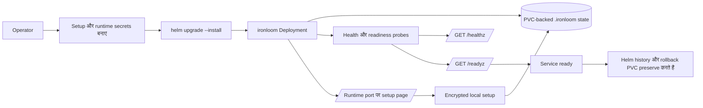

# Deployment

Runtime image `ghcr.io/vannadii/ironloom` है, जब तक registry owner बदल न जाए। Helm chart `ironloom` binary deploy करता है, जिसमें PVC-backed `.ironloom` state, setup-time encrypted local configuration, Discord, GitHub, SonarCloud और OpenAI credentials के लिए optional secret references, और health/readiness probes शामिल हैं।

k3s deployments के लिए `deploy/helm/ironloom` के अंतर्गत Helm chart उपयोग करें।

## Deployment Flow



## Runtime Secrets

Chart install करने से पहले target namespace में setup secret बनाएं। `IRONLOOM_CONFIG_KEY` base64-encoded 32-byte key material होना चाहिए। `IRONLOOM_INSTALLER_TOKEN` first-run setup form submissions authorize करता है।

```sh
kubectl create namespace ironloom
kubectl -n ironloom create secret generic ironloom-setup \
  --from-literal=config-key="$(openssl rand -base64 32)" \
  --from-literal=installer-token="$(openssl rand -base64 32)"
```

Runtime credentials Kubernetes secrets, setup page, या दोनों से provide किए जा सकते हैं। Environment-bound secrets encrypted local setup values से precedence लेते हैं।

```sh
kubectl -n ironloom create secret generic ironloom-discord \
  --from-literal=token="${IRONLOOM_DISCORD_TOKEN}" \
  --from-literal=public-key="${IRONLOOM_DISCORD_PUBLIC_KEY}"
kubectl -n ironloom create secret generic ironloom-github \
  --from-literal=token="${IRONLOOM_GITHUB_TOKEN}"
kubectl -n ironloom create secret generic ironloom-sonarcloud \
  --from-literal=token="${IRONLOOM_SONARCLOUD_TOKEN}"
kubectl -n ironloom create secret generic ironloom-openai \
  --from-literal=api-key="${IRONLOOM_OPENAI_API_KEY}"
```

OpenAI authentication के लिए `IRONLOOM_OPENAI_API_KEY` या `IRONLOOM_OPENAI_OAUTH_SESSION` provide करें। Setup page दोनों modes support करता है।

## k3s Dry Run

Cluster बदलने से पहले server-side dry run चलाएं।

```sh
helm upgrade --install ironloom deploy/helm/ironloom \
  --namespace ironloom \
  --create-namespace \
  --dry-run=server
```

## Install Or Upgrade

Validation के दौरान local chart से install करें, या release publication के बाद published OCI chart से install करें।

```sh
helm upgrade --install ironloom deploy/helm/ironloom \
  --namespace ironloom \
  --create-namespace \
  --set image.repository=ghcr.io/vannadii/ironloom \
  --set image.tag=0.1.0
```

```sh
helm upgrade --install ironloom oci://ghcr.io/vannadii/charts/ironloom \
  --namespace ironloom \
  --create-namespace \
  --version 0.1.0
```

## Smoke Checks

```sh
kubectl -n ironloom rollout status deployment/ironloom
kubectl -n ironloom port-forward service/ironloom 8080:8080
curl -fsS http://127.0.0.1:8080/healthz
curl -fsS http://127.0.0.1:8080/readyz
cargo test -p ironloom-runtime --test vertical_slice
```

## Rollback

जब तक operator destructive cleanup स्पष्ट रूप से approve न करे, PVC रखें।

```sh
helm -n ironloom history ironloom
helm -n ironloom rollback ironloom <revision>
kubectl -n ironloom rollout status deployment/ironloom
```

## Site Publishing

`.github/workflows/docs-deploy.yml` `main` पर VitePress site को GitHub Pages पर `https://ironloom.dev` में publish करता है।
